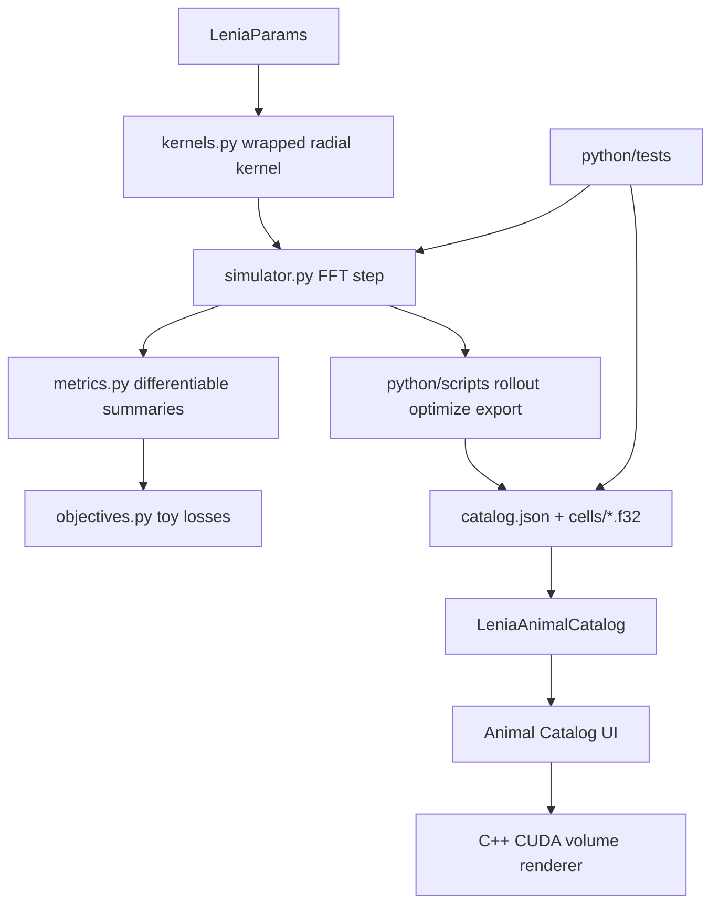

# Plan 06 复盘与教学笔记：PyTorch 可微 Backend + C++ Renderer Bridge

## 1. 这次实现了什么

Plan 06 把项目从“纯 C++/CUDA renderer + Lenia simulator”推进到了“Python/PyTorch 可微研究 backend + C++ 可视化 bridge”的阶段。现在可以在 PyTorch 里做小规模 2D/3D Lenia rollout、算 differentiable metrics、跑 toy objective、检查 gradient、导出 `.f32 + catalog.json`，再通过 C++ GUI 加载到现有 volume renderer 里看。

核心能力：

- `python/vollenia_diff/`：新增 PyTorch 版 Lenia 参数、kernel、FFT simulator、metrics、objectives、C++ export。
- `python/scripts/`：新增 smoke rollout、toy optimization、`.pt`/snapshot 到 C++ catalog 的导出脚本。
- `python/tests/`：新增 CUDA pytest，覆盖 kernel/rollout/export/gradient/compile sanity。
- `pyproject.toml`：用标准 `pyproject.toml + uv` 管理依赖，PyTorch 固定走 CUDA 12.8 wheel source，不引入 `requirements.txt`。
- `LeniaSimulator`：新增 `torch.compile` 开关，只 compile 单步 tensor compute，不包 logging/export/metrics。
- `benchmark_torch_compile.py`：新增 eager vs compiled benchmark，并定位 torch.compile warning 来自 FFT complex path。
- C++ bridge：`configs/lenia.default.json` 支持 `lenia.animal_catalog` 启动默认路径。
- GUI bridge：`Animal Catalog` 窗口新增 `Open catalog...` native file picker 和 `Reload current`，可以热插拔任意 PyTorch 导出的 `catalog.json`。

已验证过的关键结果：

```text
uv run python -m pytest python/tests
=> 6 passed

uv run python python/scripts/torch_toy_optimize.py --device cuda --size 32 --iters 10 --compile-step --out outputs/diff_bridge/toy_compile
=> loss 下降，并写出 outputs/diff_bridge/toy_compile/catalog.json

cmd.exe /c 'call "C:\Program Files\Microsoft Visual Studio\2022\Community\VC\Auxiliary\Build\vcvars64.bat" && cmake --build --preset release'
=> Release build 成功

GUI smoke
=> VolLenia_Playground.exe 保持运行 5 秒，没有提前退出
```

需要明确的是：Plan 06 的 toy optimization 目前只是 gradient / bridge sanity，不代表已经找到了稳定可见的 3D organism。早期 `toy_compile` 输出 final state 变黑是合理暴露出的实验质量问题，而不是 renderer bridge 本身失败。当时 raw metrics 里能看到：

```text
mass = -41293.0
max_density = -0.406
active_voxels = 0
```

这是因为 toy 脚本为保留梯度用了 `clip_mode="none"`，最终 state 可以跑出 `[0, 1]` 之外，C++ renderer 看到负密度/低密度自然接近黑。现在已把“优化时 unclamped”和“导出/可视化时有效密度范围”分开：`torch_toy_optimize.py` 提供 `--export-activation clamp|sigmoid|raw`，默认用 `sigmoid` 把 unconstrained toy state 映射成 renderer-visible density，并在 `metrics.json` 里同时记录 `raw_final` 和 `exported_final`。

## 2. 现在的代码结构



主要入口：

- Python package：`python/vollenia_diff/`
  - `params.py` 定义和 C++ catalog 兼容的参数 schema：`R/T/m/s/b/kn/gn`。
  - `kernels.py` 生成 2D/3D wrapped radial shell kernel，并做 sum normalization。
  - `simulator.py` 用 `torch.fft.rfftn/irfftn` 做 circular convolution，缓存 `kernel_hat`，支持 `compile_step`。
  - `metrics.py` 和 `objectives.py` 提供 differentiable search 的基础砖块。
  - `export_cpp.py` 负责 `[Z,Y,X]` tensor 到 x-fastest `.f32` 和 LeniaAnimalCatalog-compatible manifest。

- Python scripts：
  - `torch_smoke_rollout.py` 导出 step snapshots。
  - `torch_toy_optimize.py` 优化 initial-state logits，验证 loss/gradient/export。
  - `benchmark_torch_compile.py` 用 CUDA event timing 比较 eager/compiled。
  - `export_torch_state_to_cpp.py` 把已有 tensor 导出给 C++。

- C++ GUI bridge：
  - `src/io/LeniaAnimalCatalog.*` 解析 `catalog.json`。
  - `src/app/App.*` 管理 catalog runtime state、file picker、load/apply 行为。
  - `src/app/UiPanel.*` 暴露 `Open catalog...`、`Reload current`、animal combo 和 load buttons。

## 3. 关键实现路径

### 3.1 PyTorch 单步 simulation

PyTorch backend 的核心单步在 `lenia_step_tensor`：

```python
state_hat = torch.fft.rfftn(state, dim=dims)
u = torch.fft.irfftn(state_hat * kernel_hat, s=shape, dim=dims)
next_state = state + _growth_from_id(u, m, s, gn) / max(float(T), 1.0)
```

这个函数被刻意写成接近 pure tensor compute：输入 state、cached `kernel_hat` 和标量参数，输出下一步 state。这样它比较适合 `torch.compile`，同时也避免把 JSON export、metrics summary、print logging 这种会造成 graph break 的东西放进 compile 区域。

性能上做了几件重要的小事：

- 用 FFT convolution，不做 dense convolution。
- kernel 和 `kernel_hat` 缓存到 simulator，shape/device/params 变化时才重建。
- rollout 内保留 Python time loop，但每步是 vectorized tensor op。
- `.cpu()` / `.numpy()` 只出现在 export、logging、测试断言等边界。
- 默认 CUDA-only，测试和脚本不再维护 CPU fallback path。

### 3.2 torch.compile 的边界

这次的 `torch.compile` 只包单步函数，不包整个 simulator 对象，也不包 rollout loop。

这样做的原因是：compile 最擅长优化稳定的 tensor graph；kernel generation、metrics、文件 IO、print、JSON 都不是它该管的东西。后续要进一步优化时，可以考虑：

- 把 rollout loop 也变成更 compile-friendly 的结构。
- 尝试 `torch.compile(..., mode="max-autotune")`。
- 对 FFT-heavy workload 做独立 benchmark，而不是只看全脚本 wall time。

本次 warning 调查结果：Inductor 的 complex-operator warning 来自 FFT 频域路径：

```text
torch._C._fft.fft_rfftn
mul = state_hat * kernel_hat_
torch._C._fft.fft_irfftn
```

这不是普通 Python 代码写法问题，而是当前 FFT complex op 在 Inductor 里的支持/优化提示。

### 3.3 C++ bridge 和 GUI file picker

最初 bridge 只支持从 `configs/lenia.default.json` 读 `animal_catalog`，再加一个 `Reload catalog`。这个设计能跑，但不适合实验热插拔，因为每次都要手改 repo-tracked config。

后续改成：

- `configs/lenia.default.json` 只保留启动默认值。
- GUI 里通过 native file picker 选择任意 `catalog.json`。
- 选择成功后只更新当前 runtime state，不写回 config。
- 选择失败或 JSON 不兼容时保留旧 catalog/path。
- `Reload current` 用于 PyTorch 重新导出到同一路径后的热刷新。

这里选 `nativefiledialog-extended` 而不是手写 Win32 dialog，主要是因为它有现代 CMake、UTF-8 API、Windows/macOS/Linux 支持，并且适配 GLFW/ImGui 应用。

## 4. 踩过的坑与修正

| 坑 | 症状 | 原因 | 修正 | 学到什么 |
|---|---|---|---|---|
| 依赖管理方向错位 | 早期 Plan 文档提到 `requirements.txt` | 项目后续明确要求标准 `pyproject.toml + uv` | 改用 `pyproject.toml`、`uv.lock`、PyTorch CUDA index | 用户已经指定的工程约束必须优先于模板化计划 |
| PyTorch CPU path 语义不清 | “CPU pytest 快速路径”让验收边界变模糊 | backend 目标就是 CUDA PyTorch | pytest、scripts、simulator 都改成 CUDA-only | GPU-first 项目里，保留 fallback 可能反而制造错觉 |
| torch.compile warning 不明 | compile 运行时提示 complex operator | FFT pipeline 里有 complex spectrum multiply | 新增 benchmark 和 FX graph 记录，定位到 FFT rfftn/mul/irfftn | 对 compiler warning 要定位 operator，不要只说“可能是 FFT” |
| 手改 config 选择 catalog | 用户体验不适合实验热插拔 | 把 runtime experiment input 放在 repo config 里 | GUI 增加 native file picker 和 Reload current | 实验入口应该贴近实验动作，不应让用户改配置文件 |
| file picker 失败可能清空旧 catalog | 选错 JSON 后可能丢掉当前可用状态 | 直接对当前 catalog 调 `load()` 会先 clear | 用临时 `LeniaAnimalCatalog next_catalog`，成功后再 move 替换 | 加载外部资源时要尽量 preserve last-good state |
| toy final state 是黑的 | C++ 里 toy final 几乎不可见 | `clip_mode="none"` 会产生负密度，final export 没有可视化约束 | 新增 `--export-activation clamp\|sigmoid\|raw`，toy 默认 sigmoid，并记录 raw/export metrics | gradient sanity 和 visual validity 是两个不同验收目标 |
| agent 默认走捷径 | 用户后来指出 file picker 才是正确主路径 | 设计代价/依赖引入时没有及时请用户确认 | 后续遇到“轻量方案 vs 正确 UX/架构方案”要主动询问 | 不确定产品取舍时，不能把最小改动当默认答案 |

## 5. 值得补的知识点

### 5.1 differentiable simulator 不等于能活的 organism

现在 PyTorch backend 的价值是“可以对 rollout 求梯度”。这只说明 loss 对 initial logits 或参数有可导路径，不说明 loss 设计会自然产生稳定生命。

当前 toy loss 的目标是：

```text
final COM 接近 target
mass 在范围内
second moment 不要太大
border mass 不要太高
```

这些约束很弱，而且是 final-state objective。一个系统可以通过变暗、变负、扩散或坍缩来降低一部分 loss。后续要做真正的搜索，通常需要加入：

- state range / positivity 约束；
- survival window，而不是只看 final step；
- motion / persistence / compactness 的 rollout-level metric；
- environment/resource pressure；
- 多目标或 QD/MAP-Elites，而不是单一 target loss。

### 5.2 `clip_mode="none"` 的意义和风险

`hard clamp` 更贴近 C++ simulation：

```text
A_next = clamp(A + G(U) / T, 0, 1)
```

但 clamp 在边界会让 gradient 变差，所以 toy gradient sanity 用 `clip_mode="none"`。这在优化上有用，但导出给 renderer 时会出问题：renderer 期待密度大致在 `[0,1]`，负值或全低值就会黑。

现在已把 simulation mode 和 export mode 分开：

```text
optimization state: 可使用 none / soft clamp
visualization export: clamp 或 sigmoid 到 [0,1]，并在 catalog/metrics 里标注
```

对应实现位置：

- `python/vollenia_diff/export_cpp.py`：`apply_export_activation(state, mode)`。
- `python/scripts/torch_toy_optimize.py`：`--export-activation clamp|sigmoid|raw`，默认 `sigmoid`。原因是当前 toy 使用 `clip_mode="none"`，raw final 可能整体小于 0；这种情况下 clamp 会得到全 0，而 sigmoid 仍能保留连续场结构用于 renderer 检查。
- `metrics.json`：同时包含 `raw_final` 和 `exported_final`。

### 5.3 file picker 是 runtime input，不是 config

配置文件适合表达启动默认值、长期偏好、可复现实验参数。实验过程中的“这次我要打开哪个 catalog”更像 runtime input。放在 GUI file picker 里更自然，也避免修改 repo-tracked config。

这次最终结构可以这样理解：

```text
config = default startup state
file picker = runtime experiment selection
reload current = same path hot refresh
catalog manifest = Python/C++ bridge contract
```

### 5.4 CMake FetchContent 的角色

`nativefiledialog-extended` 没有 vendoring 到 repo，而是通过 CMake `FetchContent` 在 configure/build tree 中下载。

这适合小型 C/C++ dependency：

- repo 不膨胀；
- 版本由 `GIT_TAG` 固定；
- target 可以像本地库一样 link；
- 缺点是首次 configure 需要网络。

### 5.5 后续和 agent 协作的决策边界

这次摩擦的核心不是某个 API，而是决策边界：当 feature 涉及 UX/架构/依赖引入时，agent 不应该总是默认选“最小代码改动”。最小改动适合低风险 bugfix，但不一定适合研究工具的长期交互设计。

之后可以用这个规则：

```text
如果只是实现细节：Codex 自己按 repo pattern 决策。
如果影响用户工作流：先说明两个方案和取舍，必要时问用户。
如果引入新依赖：说明为什么值得引入、替代方案是什么。
如果临时方案会很快变成技术债：不要默默做临时方案。
```

## 6. 怎么继续验证或扩展

### 6.1 最小验证命令

```nu
uv run python -m pytest python/tests
```

```nu
uv run python python/scripts/torch_smoke_rollout.py --device cuda --size 32 --steps 16 --out outputs/diff_bridge/smoke_cuda
```

```nu
uv run python python/scripts/torch_smoke_rollout.py --device cuda --size 32 --steps 16 --compile-step --out outputs/diff_bridge/smoke_compile
```

```nu
uv run python python/scripts/benchmark_torch_compile.py --size 32 --steps 64 --warmup-steps 8 --repeats 5 --out outputs/diff_bridge/compile_benchmark
```

```nu
cmd.exe /c 'call "C:\Program Files\Microsoft Visual Studio\2022\Community\VC\Auxiliary\Build\vcvars64.bat" && cmake --build --preset release'
```

```nu
.\build\Release\VolLenia_Playground.exe
```

GUI 手动验证：

```text
Animal Catalog -> Open catalog...
选择 outputs/diff_bridge/smoke_compile/catalog.json
选择一个 step snapshot
点击 Load initial state + rule
```

### 6.2 下一步建议

优先级最高的修正：

1. 已修 toy export 黑图的主要工程原因：导出 final state 前提供 `--export-activation clamp|sigmoid|raw`，toy 默认 `sigmoid`。
2. 已在 toy metrics 里区分 `raw_final` 和 `exported_final`，可以同时观察优化态和 renderer 态。
3. 下一步可以在脚本结束时对不可视状态打印 warning，例如 `active_voxels == 0` 或 `max_density <= 0`。
4. smoke rollout catalog 已经包含多个 step，可以在 GUI 里比较 step 0 / step 8 / step 16 的可见性。
5. 给 toy objective 加 survival/visibility penalty，避免通过负密度或消失来“优化”。
6. 后续真正 search 前，先做 2D debug view 或更便宜的 3D summary plots。

中期扩展：

- parameter optimization：优化 `m/s/b/R/T` 或 kernel logits。
- environment fields：加入 nutrient/obstacle/poison。
- search agent：从单一 toy loss 走向 multi-objective / QD search。
- C++ replay validation：导出 PyTorch step 0/N，再做 C++ headless step dump 粗对齐。

## 7. 本 milestone 的一句话结论

Plan 06 已经把“可微实验”和“C++ 可视化检查”接通了，而且 toy export 默认会生成 renderer 可接受的 `[0,1]` density；但目前仍只是桥和工具链成立，toy optimization 还不是生命搜索本身。下一步应该把 survival metric、visibility warning 和实验 UX 做扎实，这样后面的 environment/search/agent 扩展才不会建立在隐式手工步骤上。
