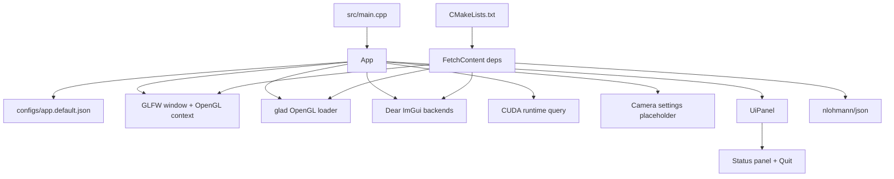

# Milestone 00 复盘与教学笔记

## 1. 这次实现了什么

Milestone 00 的目标是把 `VolLenia_Playground` 从文档包变成一个真正能 configure、build、run 的 C++20/CUDA/OpenGL 应用骨架。

现在已经具备：

- 一个 CMake 项目，启用 `CXX` 和 `CUDA`，target 名为 `VolLenia_Playground`。
- 一个 GLFW/OpenGL 3.3 core 窗口，标题来自 `configs/app.default.json`。
- 一个 Dear ImGui 面板，显示 FPS、frame time、OpenGL version、CUDA device/runtime/driver 信息和 `Quit` 按钮。
- CUDA runtime smoke query，通过 `cudaGetDeviceCount`、`cudaGetDeviceProperties`、`cudaRuntimeGetVersion` 等 API 验证 CUDA runtime 能被应用调用。
- `CudaCheck.h` 和 `GlCheck.h` 两个 error check helper，为后续 CUDA kernel、OpenGL interop、PBO 调试打底。

已验证：

```powershell
nvidia-smi
nvcc --version
cmake --version
where cl
cmd.exe /c 'call "C:\Program Files\Microsoft Visual Studio\2022\Community\VC\Auxiliary\Build\vcvars64.bat" && cmake -S . -B build -G "Visual Studio 17 2022" -A x64 -DCMAKE_CUDA_ARCHITECTURES=native && cmake --build build --config Release'
```

构建结果：

```text
build\Release\VolLenia_Playground.exe
```

运行 smoke test：启动 exe 后进程保持运行 3 秒，没有立即崩溃，然后被手动停止。尚未做人工截图级 UI 验证，所以“窗口内容是否视觉完全符合预期”仍建议你本机打开确认一次。

## 2. 现在的代码结构



关键文件：

- `CMakeLists.txt`：定义语言标准、CUDA/OpenGL 查找、FetchContent 依赖、GLAD 生成、ImGui backend library、最终 executable。
- `src/main.cpp`：程序入口，只负责创建 `vollenia::App` 并捕获顶层异常。
- `src/app/App.cpp`：生命周期核心，负责 config 读取、窗口创建、OpenGL loader、ImGui 初始化、CUDA 查询、主循环和 shutdown。
- `src/app/UiPanel.cpp`：只负责 UI 呈现，不直接管理 GLFW/CUDA/OpenGL 生命周期。
- `src/app/Camera.*`：目前只是后续 renderer 需要的相机参数占位，不做 orbit/control。
- `src/core/CudaCheck.h`：把 CUDA API 错误转换成带文件、行号、表达式的 C++ exception。
- `src/core/GlCheck.h`：对 OpenGL 调用做 `glGetError` 检查。
- `configs/app.default.json`：窗口和相机默认配置；render 字段先保留给后续 milestones。

这个结构的核心价值是：`App` 掌控生命周期，`UiPanel` 只管展示，`core` 只放可复用 error checking。后续 Milestone 01 加 PBO interop 时，不需要把 UI、窗口和 CUDA 错误检查重新拆一遍。

## 3. 关键实现路径

### 构建系统

`CMakeLists.txt` 里最重要的几件事：

- `project(... LANGUAGES CXX CUDA)` 让 CMake 同时识别 C++ 和 CUDA 编译器。
- `find_package(CUDAToolkit REQUIRED)` 提供 `CUDA::cudart`，比手写 CUDA lib path 稳。
- `FetchContent` 拉取 GLFW、Dear ImGui、glad、nlohmann/json。
- `glad_add_library(glad_gl_core_33 ... API gl:core=3.3)` 生成 OpenGL loader。
- `CMAKE_MSVC_RUNTIME_LIBRARY` 统一使用动态 CRT，修掉 `/MD` 和 `/MT` 混用链接警告。

注意这里没有 `.cu` 文件，但仍启用了 CUDA language。这是有意的：Milestone 00 要证明 CUDA toolchain 和 runtime link 已经接上，后面加 `.cu` kernel 时不用重做构建骨架。

### App 生命周期

`App::run()` 的顺序是：

```text
initialize()
  -> loadConfig()
  -> queryCudaDeviceInfo()
  -> glfwInit()
  -> create GLFW window
  -> make OpenGL context current
  -> gladLoadGL()
  -> initialize ImGui
mainLoop()
  -> poll events
  -> compute frame time
  -> build ImGui frame
  -> clear OpenGL background
  -> render ImGui
  -> swap buffers
shutdown()
  -> ImGui shutdown
  -> destroy window
  -> glfwTerminate()
```

这是一种典型 immediate-mode GUI app 结构：每帧重新描述一次 UI，ImGui 内部负责把它变成 draw commands。

### CUDA 查询

CUDA 信息查询被放在启动阶段：

```text
cudaGetDeviceCount
cudaGetDevice
cudaGetDeviceProperties
cudaRuntimeGetVersion
cudaDriverGetVersion
```

如果 CUDA 查询失败，当前实现不会直接阻止窗口创建，而是把错误文本存到 `CudaDeviceInfo.error`，让 UI 面板显示 `CUDA device: unavailable`。这对早期 debug 更友好：OpenGL/ImGui 层能不能跑，和 CUDA runtime 是否正常，可以分开看。

## 4. 踩过的坑与修正

| 坑                                | 症状                                                     | 原因                                                                       | 修正                                            | 学到什么                                                                 |
| --------------------------------- | -------------------------------------------------------- | -------------------------------------------------------------------------- | ----------------------------------------------- | ------------------------------------------------------------------------ |
| Codex 当前 PowerShell 找不到 `cl` | `where cl` 返回找不到                                    | 当前 shell 没加载 VS toolchain 环境                                        | 用 `vcvars64.bat` 显式包住 configure/build 命令 | Windows C++/CUDA 构建不能只看 VS 是否安装，还要看当前 shell 是否导入环境 |
| GLAD 生成器缺 `jinja2`            | build 时 `ModuleNotFoundError: No module named 'jinja2'` | CMake 找到的 Python 是 miniforge Python，但没有 GLAD 生成器需要的包        | CMake 创建 `build/python-venv` 并安装 `jinja2`  | 生成型依赖常常有自己的 Python side dependency，最好隔离在 build tree     |
| `Version.h` include 路径不匹配    | `Cannot open include file: 'core/Version.h'`             | `configure_file` 生成到了 `generated/Version.h`，源码引用 `core/Version.h` | 改成生成到 `generated/core/Version.h`           | 生成头文件也要遵守源码 include 目录结构，否则 IDE 和 build 都会困惑      |
| MSVC runtime 混用警告             | `defaultlib 'LIBCMT' conflicts with use of other libs`   | 某些 third-party target 与主 target runtime 设置不同                       | 设置 `CMAKE_MSVC_RUNTIME_LIBRARY` 为动态 CRT    | 早期修掉 ABI/runtime 警告很值得，后面依赖更多时会更难排查                |

补充：你刚刚说明后续必要用 Python 时尽量用 `uv python`。当前 milestone 里 GLAD venv 已经是 build-local 隔离方案，但不是 `uv` 管理；后续若继续打磨工具链，建议把这段 CMake Python bootstrap 改成优先 `uv venv` / `uv pip`，找不到 `uv` 时再 fallback 到标准库 `venv`。

## 5. 值得补的知识点

### CMake target 思维

这个项目后面会同时有 CUDA、OpenGL、ImGui、cuFFT、renderer、simulation。如果用全局 include path 和全局 link flags，很快会乱。现在 CMake 用的是 target 思维：

```text
imgui_backend target
glad_gl_core_33 target
VolLenia_Playground target
```

每个 target 自己声明 include、compile definition、link dependency。后续加 `render`、`sim`、`io` library 时也应该沿用这个方式。

### OpenGL loader 为什么需要 GLAD

Windows 上系统自带 OpenGL 入口通常很老。现代 OpenGL 函数需要在 context 创建后动态加载。这个顺序很重要：

```text
glfwCreateWindow
glfwMakeContextCurrent
gladLoadGL(glfwGetProcAddress)
```

如果还没创建 context 就加载 GL function pointer，后续 OpenGL 调用会空指针或行为不确定。

### ImGui 的 mental model

Dear ImGui 是 immediate-mode GUI：不是先创建一棵永久 UI tree，而是每帧执行：

```text
NewFrame
ImGui::Text / Button / ...
Render
backend draw
```

所以 `UiPanel::render()` 每帧都会被调用一次。按钮返回值只在当前帧有效，当前实现用它触发 `glfwSetWindowShouldClose`。

### CUDA runtime check helper 的价值

CUDA API 很多错误不会自动变成 C++ exception。如果只写：

```cpp
cudaGetDeviceProperties(&props, device);
```

失败时很容易被忽略。现在统一写：

```cpp
VOL_CUDA_CHECK(cudaGetDeviceProperties(&props, device));
```

错误信息会带上 expression、文件和行号。等 Milestone 01 有 PBO registration、map/unmap、kernel launch 时，这个 helper 会非常省时间。

### OpenGL error check 的局限

`VOL_GL_CHECK` 对早期调试有用，但 `glGetError` 是同步检查，后面每帧高频路径里可能影响性能。建议策略是：

```text
bootstrap / debug path: 多检查
hot render loop: 先保留，性能调优时再降频或做 debug-only
```

## 6. 怎么继续验证或扩展

最小手动 smoke test：

```powershell
.\build\Release\VolLenia_Playground.exe
```

你应该确认：

- 窗口标题是 `VolLenia Playground`。
- ImGui 面板出现。
- 面板显示 FPS/frame time。
- 面板显示 RTX 4060 Ti 和 CUDA runtime/driver 信息。
- 点击 `Quit` 能退出。

如果 Codex shell 需要显式 VS 环境：

```powershell
cmd.exe /c 'call "C:\Program Files\Microsoft Visual Studio\2022\Community\VC\Auxiliary\Build\vcvars64.bat" && cmake --build build --config Release'
```

下一步进入 Milestone 01 时，建议优先做：

- 新增 OpenGL PBO 和 fullscreen display path。
- 注册 PBO 到 CUDA：`cudaGraphicsGLRegisterBuffer`。
- 写一个最小 CUDA kernel 输出动态图案。
- resize 时释放并重建 PBO/CUDA graphics resource。

当前技术债和注意点：

- GLAD Python bootstrap 建议后续按偏好改成优先 `uv`。
- 目前只做了进程级 smoke test，未做截图/视觉自动验证。
- `render` config 字段目前未消费，是给后续 renderer milestone 预留的。
- 还没有测试 target；Milestone 01 开始可以考虑给 config parsing 或 core helpers 加最小单元测试。
