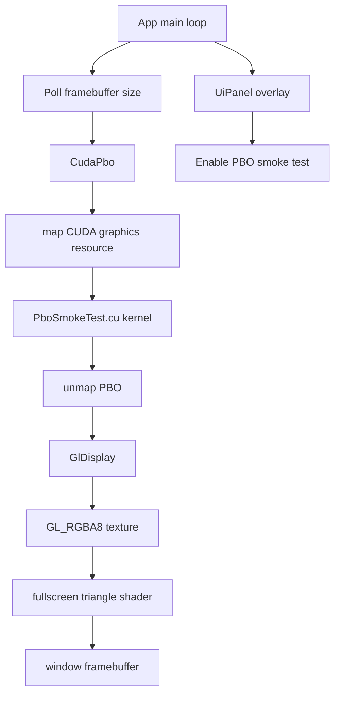

# Milestone 01 复盘与教学笔记

## 1. 这次实现了什么

Milestone 01 的目标是验证第一条真正的 GPU 显示链：

```text
CUDA kernel -> OpenGL PBO -> GL texture -> fullscreen triangle -> ImGui overlay
```

这次没有做 volume renderer、cuFFT、Lenia simulation，也没有把 PBO 内容读回 CPU。它只是生成一个 CUDA 写入的动态 RGBA 图案，并证明它可以留在 GPU 上被 OpenGL 显示出来。

新增能力：

- `CudaPbo`：拥有 OpenGL PBO 和 CUDA graphics resource，支持 resize、map、unmap、destroy。
- `GlDisplay`：拥有 RGBA8 texture、OpenGL 3.3 core VAO、shader program，用 fullscreen triangle 显示 PBO 内容。
- `PboSmokeTest.cu`：CUDA kernel 输出 x/y gradient 加随时间变化的 wave/ring 图案，`alpha = 255`。
- `App` 主循环：每帧轮询 framebuffer size，尺寸变化时重建 PBO/display 资源，先绘制 CUDA 图案，再绘制 ImGui overlay。
- `UiPanel`：增加 `CUDA/OpenGL interop` section，可以查看 framebuffer size、PBO byte size、animation time、resource/status/last error，并用 checkbox 启停 smoke test。

已验证：

```powershell
git diff --check
cmake --build --preset release
.\build\Release\VolLenia_Playground.exe
cmake --build build --config Debug
cmd.exe /c 'call "C:\Program Files\Microsoft Visual Studio\2022\Community\VC\Auxiliary\Build\vcvars64.bat" && cmake --build --preset clangd-ninja'
```

运行 smoke test 的证据是：exe 启动后保持运行 5 秒，没有立即崩溃，然后被手动停止。尚未由我做人工视觉验收，所以动态图案、resize、minimize/restore、checkbox 的肉眼确认仍建议你本机点一遍。

额外检查：搜索 `glReadPixels`、`glDrawPixels`、`cudaMemcpy*DeviceToHost` 等关键词没有匹配；从现有证据看，没有 CPU readback 路径。

## 2. 现在的代码结构



关键文件：

- `src/render/CudaPbo.*`：CUDA/OpenGL interop resource 的 RAII owner。
- `src/render/GlDisplay.*`：OpenGL texture + fullscreen triangle display helper。
- `src/render/PboSmokeTest.*`：只负责生成测试图案，后续 PLAN 02 可以替换掉。
- `src/app/App.*`：把 render 资源放进主生命周期，并确保释放顺序正确。
- `src/app/UiPanel.*`：展示 interop 状态，并暴露 enable checkbox。
- `CMakeLists.txt`：加入 `.cu` 源文件，并把 MSVC warning flags 限制在 C++ 编译上。

这次的结构刻意把三件事拆开：

```text
CudaPbo     = 资源互操作
GlDisplay   = OpenGL 显示
Smoke kernel = 临时测试图案
```

这样后续做 volume renderer 时，可以保留 `CudaPbo` 和 `GlDisplay`，只替换 `PboSmokeTest.cu` 那一层。

## 3. 关键实现路径

### 每帧执行顺序

`App::mainLoop()` 现在大致是：

```text
glfwPollEvents
update frame time / animation time
glClear
updateFramebufferResources
renderPboSmokeFrame
ImGui NewFrame
UiPanel render
ImGui Render
glfwSwapBuffers
```

重点是：CUDA smoke image 在 ImGui 之前画，所以 ImGui 会自然成为 overlay。

### PBO resource 生命周期

`CudaPbo::resize(width, height)` 做了这几件事：

```text
destroy old resource if needed
glGenBuffers
glBindBuffer(GL_PIXEL_UNPACK_BUFFER)
glBufferData(width * height * sizeof(uchar4), nullptr, GL_STREAM_DRAW)
cudaGraphicsGLRegisterBuffer(..., cudaGraphicsRegisterFlagsWriteDiscard)
```

每帧写入时：

```text
cudaGraphicsMapResources
cudaGraphicsResourceGetMappedPointer
launchPboSmokeTest
cudaGraphicsUnmapResources
```

销毁时顺序相反：

```text
unmap if needed
cudaGraphicsUnregisterResource
glDeleteBuffers
```

这个顺序很重要：CUDA 注册过的 GL buffer 必须先 unregister，再 delete GL buffer；并且这些都必须发生在 OpenGL context 还活着的时候。

### OpenGL display path

`GlDisplay` 做的是一个现代 OpenGL core profile 的最小显示管线：

```text
PBO -> glTexSubImage2D -> GL_RGBA8 texture -> fullscreen triangle shader
```

为什么要 fullscreen triangle，而不是 quad：

- 一个 triangle 就能覆盖整个屏幕，少一个对角线 seam 的潜在问题。
- vertex shader 用 `gl_VertexID` 生成三个顶点，不需要 VBO。
- OpenGL core profile 仍然要求有 VAO，所以 `GlDisplay` 创建并绑定 VAO。

### CUDA smoke kernel

`PboSmokeTest.cu` 里 kernel 的核心思想是：

```text
x/y -> normalized u/v
radius -> wave
time -> animated sweep
uchar4 RGBA output
```

它不是 renderer，只是“这帧确实由 CUDA 生成”的可视化信号。Debug build 下 kernel launch 后会 `cudaDeviceSynchronize()`，Release 则只做 launch error check，避免每帧强制同步。

## 4. 踩过的坑与修正

| 坑 | 症状 | 原因 | 修正 | 学到什么 |
|---|---|---|---|---|
| MSVC warning flags 传给 nvcc | nvcc 报 `A single input file is required...` | `/W4 /permissive-` 被作为 CUDA 编译参数混进 nvcc 命令行 | CMake 用 `$<$<COMPILE_LANGUAGE:CXX>:/W4 /permissive->` 只给 C++ 源文件 | mixed C++/CUDA target 里，compile options 要按语言分流 |
| `unique_ptr<GlDisplay>` incomplete type | MSVC 报 `can't delete an incomplete type` | `App()` 在头文件内联 default，编译 `main.cpp` 时只看到 `GlDisplay` 前向声明 | 把 `App::App() = default` 移到 `App.cpp`，在那里完整类型已 include | 用 `unique_ptr<T>` + forward declaration 时，构造/析构生成点要看到完整类型 |
| Ninja preset 在未加载 VS 环境的 shell 里失败 | 找不到 `<cstddef>`、`limits.h`，nvcc 找不到 `cl.exe` | Ninja 直接调用 `cl.exe`，当前 Codex PowerShell 没有 VS include/lib/PATH | 用 `vcvars64.bat` 包住 `cmake --build --preset clangd-ninja` | Ninja 不像 VS generator 那样帮你兜住开发者环境，shell 环境要先准备好 |
| map 成功但后续取 pointer 失败的边界 | 可能让 `mapped_` 状态卡住 | `cudaGraphicsMapResources` 成功后，`cudaGraphicsResourceGetMappedPointer` 仍可能失败 | 在 `CudaPbo::map()` catch 后主动 `unmap()` 再 rethrow | 对跨 API resource，异常路径也要恢复 ownership 状态 |
| framebuffer 为 0 的窗口状态 | minimize 时 CUDA launch/draw 可能拿到无效尺寸 | Windows 上窗口最小化可能返回 0x0 framebuffer | main loop 检测非正尺寸，跳过 CUDA 和 draw | resize/minimize 是图形 app 的真实路径，不是边角小事 |

## 5. 值得补的知识点

### PBO interop 的 mental model

PBO 是 OpenGL buffer，但它可以被 CUDA 暂时 map 成 device pointer。关键约束是：

```text
CUDA map 期间：CUDA 写
CUDA unmap 后：OpenGL 读
```

不要同时让 OpenGL 和 CUDA 访问同一块 PBO。现在的代码每帧严格按 map -> kernel -> unmap -> GL upload/draw 排序，这就是最简单也最稳的 interop discipline。

### `cudaGraphicsRegisterFlagsWriteDiscard`

这个 flag 告诉 CUDA：这帧会重写整块 buffer，不需要保留旧内容。对这种 full-frame smoke test 很合适，因为每个 pixel 都由 CUDA kernel 写入。后续如果做 partial update，就要重新审视这个选择。

### `glTexSubImage2D(..., nullptr)` 为什么能从 PBO 上传

平时 `glTexSubImage2D` 的最后一个参数像是 CPU pointer。但当绑定了：

```cpp
glBindBuffer(GL_PIXEL_UNPACK_BUFFER, pbo);
```

这个参数就变成 PBO 内部 offset。传 `nullptr` 等价于从 PBO offset 0 开始上传。这个细节是 PBO display path 的核心。

### fullscreen triangle 的 `gl_VertexID`

`GlDisplay` 没有 VBO。vertex shader 里用 `gl_VertexID` 生成三个 clip-space 顶点：

```text
(-1, -1), (3, -1), (-1, 3)
```

这三个点组成一个超大三角形，覆盖整个 viewport。fragment shader 再根据插值出来的 UV 采样 texture。

### 为什么 resource owner 要 RAII

CUDA/OpenGL interop resource 有多个释放步骤：

```text
unmap
unregister
delete GL buffer
delete GL texture / VAO / program
```

把这些散落在 `App` 里，很容易在 resize、异常、shutdown 分支里漏一个。`CudaPbo` 和 `GlDisplay` 作为 RAII owner 的价值，就是把“谁创建谁释放”固定下来。

## 6. 怎么继续验证或扩展

最小手动 smoke test：

```powershell
.\build\Release\VolLenia_Playground.exe
```

建议你确认：

- 能看到随时间变化的 CUDA 图案。
- ImGui 面板仍在最上层。
- `Enable PBO smoke test` 能关掉/恢复图案。
- 拖动窗口 resize 后图案仍覆盖窗口。
- 最小化/恢复不崩。
- 关闭窗口无 crash。

构建验证命令：

```powershell
cmake --build --preset release
cmake --build build --config Debug
cmd.exe /c 'call "C:\Program Files\Microsoft Visual Studio\2022\Community\VC\Auxiliary\Build\vcvars64.bat" && cmake --build --preset clangd-ninja'
```

进入 PLAN 02 时，建议复用：

- `CudaPbo` 作为 CUDA 写 framebuffer 的目标。
- `GlDisplay` 作为最终 fullscreen display path。
- `App` 的 framebuffer resize 轮询和 minimize skip 策略。

PLAN 02 应该替换或旁路：

- `PboSmokeTest.cu` 的临时图案 kernel。
- `UiPanel` 里 smoke-test 专用状态，改成 volume renderer 参数和状态。

当前技术债：

- 还没有自动截图或 pixel-level visual test，动态图案只做了进程级 smoke test。
- `VOL_GL_CHECK` 在 hot path 每帧调用较多，调性能前可以考虑 debug-only 或降频。
- `PboSmokeUiState` 暂时放在 `App.h`，后续 renderer 状态变复杂时可能需要移到 render/UI 专用类型。
- `clangd-ninja` 需要已加载 VS 环境；如果要更顺手，可以后续给 README 或脚本补一个明确入口。
