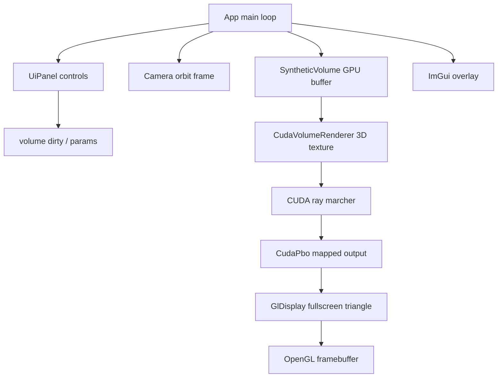

# Milestone 02 复盘与教学笔记

## 1. 这次实现了什么

Milestone 02 把 PLAN 01 的 CUDA/OpenGL PBO smoke path 升级成了一个最小可交互的 CUDA volume renderer：

```text
SyntheticVolume linear CUDA buffer
  -> CUDA 3D array / texture object
  -> CudaVolumeRenderer ray marcher
  -> existing CudaPbo
  -> existing GlDisplay
  -> ImGui overlay
```

这次仍然没有接 Lenia simulation、cuFFT、CPU readback、transfer-function editor 或复杂 lighting。目标是先证明“体数据留在 GPU 上，CUDA ray marching 写进 PBO，再由 OpenGL 显示”这条主链路跑通。

新增能力：

- `SyntheticVolume`：在 GPU linear `float*` buffer 里生成 synthetic 3D volume。
- `CudaVolumeRenderer`：把 linear volume 上传到 CUDA 3D array，创建 normalized-coordinate texture object，并每帧 ray march 写入已 map 的 PBO。
- `RenderParams.h`：集中定义 `VolumePreset`、`VolumeRenderMode`、`VolumeDesc`、`RenderParams`、`VolumeRenderStatus`、`CameraFrame`。
- `Camera`：从占位参数升级为 orbit camera，支持左键旋转、滚轮 zoom、UI reset，并输出 CUDA kernel 需要的 camera frame。
- `UiPanel`：加入 volume preset、resolution、render mode、step size、density scale、threshold、brightness、early exit、max steps、camera distance/FOV 等控制。
- `App`：用 volume renderer 替换默认 smoke draw path，保留 PLAN 01 的 `CudaPbo` 和 `GlDisplay` 作为输出基础设施。

已验证：

```powershell
cmake --build --preset release
cmake --build build --config Debug
git diff --check
rg -n "glRead|ReadPixels|glDrawPixels|cudaMemcpyDeviceToHost|cudaMemcpyDtoH" src CMakeLists.txt
cmd.exe /c 'call "C:\Program Files\Microsoft Visual Studio\2022\Community\VC\Auxiliary\Build\vcvars64.bat" && cmake --build --preset clangd-ninja'
.\build\Release\VolLenia_Playground.exe
```

你本机人工验收也已经通过：可进入下一阶段。

## 2. 现在的代码结构



关键文件：

- `src/render/RenderParams.h`：renderer 的共享语言层，避免 App/UI/CUDA renderer 各自定义一套状态。
- `src/render/SyntheticVolume.*`：生成和持有 volume source data。
- `src/render/CudaVolumeRenderer.*`：持有 CUDA 3D array / texture object，并执行 ray marching。
- `src/render/CudaPbo.*`：沿用 PLAN 01 的 CUDA/OpenGL interop framebuffer。
- `src/render/GlDisplay.*`：沿用 PLAN 01 的 PBO to texture to fullscreen triangle 显示路径。
- `src/app/Camera.*`：把 UI/input 的 orbit camera 状态转换成 CUDA 可用的 `CameraFrame`。
- `src/app/App.*`：生命周期、dirty flag、frame order、异常恢复和 shutdown 顺序。
- `src/app/UiPanel.*`：用户可调参数和状态显示。

结构上的重点是：`CudaPbo` 和 `GlDisplay` 没有被重写，而是作为稳定底座继续复用。PLAN 02 真正替换的是“PBO 里写什么”：从 `PboSmokeTest.cu` 的动态图案，换成 `CudaVolumeRenderer.cu` 的体渲染结果。

## 3. 关键实现路径

### 启动与资源初始化

`App::initialize()` 创建 GLFW/OpenGL/ImGui 后，新增了三类 renderer 资源：

```text
CudaPbo
GlDisplay
SyntheticVolume
CudaVolumeRenderer
```

`configs/app.default.json` 现在也包含了 volume/render/camera 默认值：

```json
"render": {
  "step_size": 0.01,
  "density_scale": 4.0,
  "threshold": 0.02,
  "brightness": 1.4,
  "early_exit_transmittance": 0.01,
  "max_steps": 512,
  "mode": "emission_absorption"
},
"volume": {
  "resolution": 128,
  "preset": "lenia_phantom"
}
```

这些默认值的意义是：启动时就能看到一个有层次的体，不需要先手动调 UI。

### 每帧执行顺序

现在的主循环可以理解为：

```text
poll events
ImGui new frame
handle camera input
render UI and collect changes
clear framebuffer
resize PBO/display if framebuffer changed
if volume dirty: regenerate SyntheticVolume
if renderer texture dirty: upload volume to CUDA 3D array
map PBO
ray march volume into PBO
unmap PBO
draw PBO through GlDisplay
render ImGui overlay
swap buffers
```

有两个 dirty flag 很关键：

- `volume_dirty_`：volume preset、resolution 或 regenerate 变了，需要重新生成 GPU linear volume。
- `renderer_volume_dirty_`：linear volume 变了，需要重新上传到 CUDA 3D array / texture object。

这样做可以避免每帧重建 3D texture。普通参数变化，比如 step size、threshold、brightness、camera orbit，只影响当前帧 ray marching，不重建 volume。

### SyntheticVolume

`SyntheticVolume` 只拥有一块 GPU linear buffer：

```text
float* data_
VolumeDesc desc_
VolumePreset preset_
```

`resize()` 负责 `cudaMalloc`/释放；`generate()` 负责启动 CUDA kernel 生成体素值。当前 preset 包括：

- `Sphere`：实心球。
- `Shell`：壳层结构。
- `GaussianBlobs`：多个软 blob。
- `LeniaPhantom`：类似 Lenia/生命体结构的 phantom pattern。
- `AxisRamp`：debug 用的坐标渐变。

这里没有 CPU 读回，也没有从文件加载。第一版 renderer 先用 synthetic data，是为了把“数据生成”和“体渲染链路”都控制在最短路径里。

### CudaVolumeRenderer

`CudaVolumeRenderer::setVolume()` 做的是 volume upload：

```text
destroy old texture/array
cudaMalloc3DArray
cudaMemcpy3D DeviceToDevice
cudaCreateTextureObject
```

texture 设置使用：

```text
addressMode = clamp
filterMode = linear
normalizedCoords = true
readMode = element type
```

这意味着 kernel 里可以用 `tex3D<float>(texture, u, v, w)` 在 `[0, 1]` normalized coordinate 下采样，并获得硬件 linear filtering。后续做更平滑的 volume rendering 时，这个选择很重要。

`CudaVolumeRenderer::render()` 每帧启动 ray marcher，输出目标就是 PLAN 01 的 PBO mapping：

```text
uchar4* output
width x height
CameraFrame
RenderParams
```

kernel 核心步骤：

```text
screen pixel -> NDC
NDC + camera frame -> ray direction
ray vs [-1, 1]^3 box intersection
fixed step march
tex3D sample
mode-specific compositing
write uchar4
```

### 三种 render mode

`EmissionAbsorption` 是默认模式。它把 density 转成 color/alpha，做 front-to-back compositing：

```text
accum += transmittance * alpha * color
transmittance *= 1 - alpha
```

`MIP` 是 maximum intensity projection。它沿 ray 取最大 sample，适合 debug volume 的整体形状。

`FirstHit` 是第一个超过 threshold 的采样点，适合看边界和 threshold 是否合理。

这三种模式组合起来很实用：默认模式看“像不像体渲染”，MIP 看“数据有没有”，FirstHit 看“阈值和外壳在哪里”。

### Camera

`Camera` 不依赖 OpenGL matrix，而是直接输出 CUDA 需要的向量：

```text
position
forward
right
up
fov_y_degrees
aspect
```

这样 CUDA kernel 可以自己生成 perspective ray，不需要把 GL projection/view matrix 搬到 device 侧。当前交互是：

- 左键拖动：orbit yaw/pitch。
- 滚轮：zoom distance。
- UI：调 distance/FOV/reset。
- ImGui 捕获鼠标时：不处理 orbit/zoom，避免拖 slider 时相机乱转。

## 4. 踩过的坑与修正

| 坑                                | 症状                                                             | 原因                                                                 | 修正                                                                        | 学到什么                                                        |
| --------------------------------- | ---------------------------------------------------------------- | -------------------------------------------------------------------- | --------------------------------------------------------------------------- | --------------------------------------------------------------- |
| 不能每帧重建 volume texture       | 参数调整会潜在卡顿                                               | `cudaMalloc3DArray` 和 `cudaMemcpy3D` 是重资源操作                   | 用 `volume_dirty_` / `renderer_volume_dirty_` 区分重建和普通 per-frame 参数 | GPU resource lifecycle 要和 UI 参数变化频率分层                 |
| minimized framebuffer             | 最小化时 framebuffer 可能是 `0 x 0`                              | Windows/GLFW resize 路径会给出无效渲染目标                           | framebuffer 非正尺寸时跳过 CUDA launch/draw，并在 UI 显示 skipped           | 图形程序必须把 minimize 当正常状态                              |
| CUDA/OpenGL interop 异常路径      | render 中间抛异常可能让 PBO 保持 mapped                          | map/unmap 跨 API，状态不一致会影响下一帧或 shutdown                  | `renderVolumeFrame()` catch 分支里如果已 map 就先 unmap                     | 跨 API resource 要保证异常路径也恢复 ownership                  |
| camera 与 ImGui 鼠标冲突          | 拖 UI 时相机也会动                                               | ImGui 和 app 都在读鼠标输入                                          | 检查 `io.WantCaptureMouse` 后再处理 orbit/zoom                              | Immediate UI 和 viewport input 要明确输入优先级                 |
| clangd 把 nvcc flag 当 clang flag | `.cu/.h` 显示 unknown argument，如 `-Xcompiler`、`--arch=native` | `compile_commands.json` 来自 CUDA/Ninja，clangd 会读到 nvcc 专用参数 | `.clangd` 增加 `CompileFlags.Remove` 清洗 nvcc-only flags                   | clangd 的 compile database 需要为 editor diagnostics 做一点适配 |

## 5. 值得补的知识点

### CUDA 3D array 和 linear buffer 的区别

`SyntheticVolume` 先生成 linear buffer，是因为普通 CUDA kernel 写 `float*` 最直接：

```text
index = x + y * nx + z * nx * ny
```

但 ray marcher 采样时更想要 hardware texture sampling：clamp addressing、normalized coordinate、linear filtering。CUDA 3D array 正是 texture object 的合适后端。所以这次用了两段式：

```text
linear float* for generation
cudaArray_t + texture object for sampling
```

这不是多此一举，而是在“生成方便”和“采样方便”之间做分工。

### Ray-box intersection

volume 被放在 `[-1, 1]^3` cube 里。每个 pixel 生成一条 ray，先求 ray 和 cube 的进入/离开距离：

```text
t_near, t_far
```

如果没有相交，这个 pixel 直接写背景色；如果相交，就从 `t_near` march 到 `t_far`。这个步骤避免了在整个空间里盲目采样，也是 volume ray marching 的基础。

### Front-to-back compositing

`EmissionAbsorption` 可以这样理解：

```text
越靠前的 density 先吸收光
剩下的 transmittance 再继续穿过后面的 density
```

所以代码里会维护 `transmittance`。当它低于 `early_exit_transmittance` 时，后面即使继续采样也几乎看不见，可以提前退出。这是最简单的 early exit 优化。

### 为什么 UI 参数不都触发 regenerate

参数可以分两类：

- 改变 volume data：preset、resolution、seed，需要 regenerate/upload。
- 改变怎么看 volume：camera、threshold、brightness、step size、render mode，只需要下一帧重新 ray march。

这类分层会直接影响交互手感。把所有 slider 都接到 regenerate 上，程序会明显变卡。

### 为什么 `PboSmokeTest.cu` 还留着

它已经不再是默认主路径，但保留是有价值的：当 volume renderer 出问题时，可以临时切回一个更短的 CUDA -> PBO -> GL 显示链路，判断问题是在 interop/display，还是在 volume renderer 本身。

## 6. 怎么继续验证或扩展

最小运行验证：

```powershell
.\build\Release\VolLenia_Playground.exe
```

建议继续保留的手动验收清单：

- `Sphere`、`Shell`、`GaussianBlobs`、`LeniaPhantom`、`AxisRamp` 都能显示且可区分。
- `Emission absorption`、`MIP`、`First hit` 都能切换。
- `Step size`、`Density scale`、`Threshold`、`Brightness`、`Max steps` 对画面有即时影响。
- 左键 orbit、滚轮 zoom、Reset camera 正常。
- resize、minimize/restore、关闭窗口不崩溃。

后续最自然的扩展路径：

- 给 renderer 增加 gradient normal 和简单 lighting，让形状更立体。
- 加 transfer function editor，而不是现在固定的 `transferColor()`。
- 把 SyntheticVolume 替换成 Lenia simulation 的 3D state buffer。
- 做 double PBO 或 async timing，减少同步压力并量化 GPU cost。
- 加 screenshot/pixel-level smoke test，避免只靠人工视觉确认。

当前技术债：

- 还没有 GPU timer 或 per-stage profiler，性能变化只能靠体感和 FPS。
- 体素分辨率选项故意限制在 `64/96/128/160`，避免第一版 MVP 误选太大导致卡顿。
- `CudaVolumeRenderer.cu` 的 transfer function 还是硬编码，后续会成为 UI/renderer 接口设计点。
- `PboSmokeTest` 目前是备用链路，不在主 UI path 里；如果后续想保留 debug toggle，可以重新接一个隐藏/advanced 控件。
