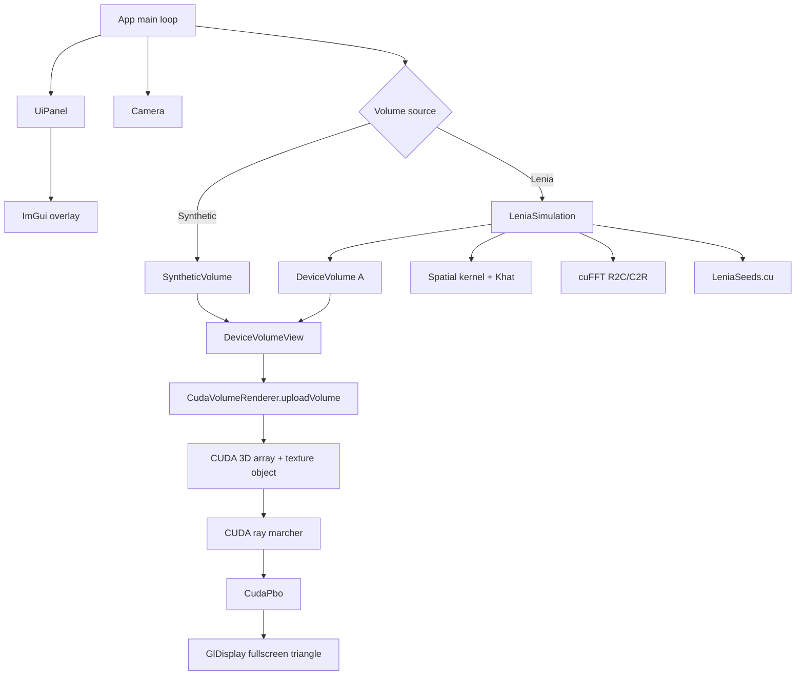

# Milestone 03 复盘与教学笔记：Single-channel 3D Lenia Simulation MVP

## 1. 这次实现了什么

Milestone 03 把项目从“能显示 synthetic 3D volume”的 renderer demo，推进到了“能在 GPU 上演化并实时渲染 single-channel 3D Lenia”的 simulation MVP。

现在的数据链路是：

```text
Lenia state A(x,y,z)
  -> cuFFT R2C
  -> Ahat * Khat
  -> cuFFT C2R
  -> Gaussian growth update
  -> generic DeviceVolumeView
  -> CUDA 3D texture / ray marcher
  -> existing CudaPbo
  -> existing GlDisplay
  -> ImGui overlay
```

关键能力：

- 新增 CUDA + cuFFT 的 single-channel 3D Lenia simulation。
- 保留 `Synthetic / Lenia` source toggle，synthetic renderer 仍可作为 debug source。
- UI 支持 `Play/Pause`、`Single step`、`Reset seed`、`Regenerate seed`、`Steps per frame`、Lenia resolution、seed preset、parameter preset，以及 `R / T / mu / sigma` 调参。
- renderer 不依赖 Lenia 类型，而是消费 generic `DeviceVolumeView`，这为后续 Plan 04 的 animals3D importer 和 Plan 05 之后的 simulation 变体留了空间。
- 没有 full-volume CPU readback；只读回一个 scalar invalid flag，用于发现 NaN/Inf 并在 UI 状态里报告。

主要新增文件：

- `src/core/VolumeDesc.h`：共享的 volume 描述和 `DeviceVolumeView`。
- `src/sim/DeviceVolume.*`：CUDA linear float volume 的 RAII 管理。
- `src/sim/CufftCheck.h`：cuFFT error check helper。
- `src/sim/LeniaParams.h`：Lenia source、parameter preset、seed preset、status。
- `src/sim/LeniaSeeds.cu`：GPU procedural initial states。
- `src/sim/LeniaSimulation.cu`：cuFFT plans、kernel spectrum、simulation step。
- `configs/lenia.default.json`：默认 Lenia 配置。

主要修改文件：

- `src/render/CudaVolumeRenderer.*`：从 `SyntheticVolume` 专用上传改成 generic `DeviceVolumeView` 上传。
- `src/render/SyntheticVolume.h`：暴露 `view()`，和 Lenia 走同一 renderer 上传接口。
- `src/app/App.*`：接入 Lenia config、simulation 生命周期、source switching 和 render loop。
- `src/app/UiPanel.*`：增加 Lenia 控制面板和状态显示。
- `CMakeLists.txt`：加入新 `.cu` 文件并链接 `CUDA::cufft`。

已做过的验证：

```powershell
cmake --build --preset release
cmake --build build --config Debug
cmd.exe /c 'call "C:\Program Files\Microsoft Visual Studio\2022\Community\VC\Auxiliary\Build\vcvars64.bat" && cmake --build --preset clangd-ninja'
git diff --check
clangd --check=src/sim/LeniaSimulation.cu --compile-commands-dir=build-clangd
clangd --check=src/sim/LeniaSeeds.cu --compile-commands-dir=build-clangd
rg -n "glRead|ReadPixels|glDrawPixels|cudaMemcpyDeviceToHost|cudaMemcpyDtoH" src CMakeLists.txt
```

另外做过一次 Release 进程 smoke test：程序启动后保持运行 8 秒，再由脚本停止。你后续的手动验收也确认了交互和显示基本没问题。

## 2. 现在的代码结构



这个结构里最重要的边界是 `DeviceVolumeView`：

```cpp
struct DeviceVolumeView {
    VolumeDesc desc;
    const float* data = nullptr;
};
```

`CudaVolumeRenderer` 不知道 volume 来自 procedural synthetic volume，还是 Lenia simulation。它只知道：“这里有一块 GPU linear float buffer，尺寸是 `nx * ny * nz`，layout 是 x-fastest。”

这条边界很值得保留。它让后续 Plan 04 可以把 animals3D RLE 解码成某个 `DeviceVolume`，再交给同一个 renderer，而不用动 ray marcher。

## 3. 关键实现路径

### 3.1 Volume layout

当前 simulation 和 renderer 都统一使用：

```cpp
index = (z * ny + y) * nx + x;
```

也就是 x 是 fastest-changing dimension。这件事看起来小，但对 cuFFT 很关键。因为 3D cuFFT plan 对应的是：

```cpp
cufftPlan3d(&r2c_plan_, nz, ny, nx, CUFFT_R2C);
cufftPlan3d(&c2r_plan_, nz, ny, nx, CUFFT_C2R);
```

频域 packed size 因此是：

```text
nz * ny * (nx / 2 + 1)
```

如果误写成 `nx * ny * (nz / 2 + 1)`，程序可能还能编译，但频域 buffer 大小和访问都会错，结果会变成非常难查的 GPU memory bug。

### 3.2 Simulation step

`LeniaSimulation::simulateSteps()` 每一步做：

```text
1. A -> Ahat
2. Uhat = Ahat * Khat
3. Uhat -> U
4. u = U / voxel_count
5. growth = 2 * exp(-((u - mu)^2) / (2 * sigma^2)) - 1
6. A = clamp(A + growth / T, 0, 1)
```

这里 `U / voxel_count` 是 inverse FFT normalization。cuFFT 的 C2R 不会自动除以 N，所以我们必须手动乘 `1 / (nx * ny * nz)`。不做这一步，potential 会被体素数放大，Lenia 状态会很快炸到 0 或 1。

### 3.3 Kernel generation

MVP 在 CPU 上生成 spatial radial shell kernel，然后上传 GPU，再对 kernel 做 R2C 得到 `Khat`。这样做不是最终性能最优，但 kernel 只在 `R` 或 shell weights 变化时重建，MVP 阶段足够稳，也更容易检查归一化。

本次实现采用 origin-periodic distance：

```text
dx = min(x, nx - x)
dy = min(y, ny - y)
dz = min(z, nz - z)
```

这样生成出来的 kernel 天然对齐 FFT circular convolution 的 origin，不需要再做一次 roll。

### 3.4 Renderer upload

Plan 02 里 renderer 还比较像 “SyntheticVolume renderer”。Plan 03 把它改成：

```cpp
void CudaVolumeRenderer::uploadVolume(DeviceVolumeView volume);
```

如果 volume dimensions 变了，就重建 CUDA 3D array 和 texture object；如果尺寸不变，就复用 texture object，只做 device-to-device `cudaMemcpy3D`。这避免了每帧 destroy/recreate CUDA texture 的开销和资源风险。

## 4. 参数 preset 和初期状态现在是分开的吗？

是的，当前实现里 **演化参数** 和 **初期状态** 是分开的。

当前 UI 有两组独立选择：

- `Parameter preset`：例如 `Diguttome saliens`、`Diguttome tardus`、`Triguttome labens`。它们决定 Lenia rule 的 `R / T / mu / sigma / b`。
- `Seed preset`：例如 `Reference random box`、`Centered random ball`、`Asymmetric Gaussian cluster`。它们决定初始的 `A(x,y,z)` 长什么样。

这在 Milestone 03 是有意设计的。原因是这一阶段的目标不是复现 Lenia3D animal catalog，而是验证 CUDA/cuFFT simulation path：

- FFT layout 是否正确。
- kernel 归一化是否正确。
- inverse FFT normalization 是否正确。
- 状态能否稳定 clamp 到 `[0,1]`。
- renderer 能否显示任意 generic float volume。

把参数和初始状态拆开，方便做 debug：同一个 seed 可以换不同 rule，同一个 rule 可以换不同 seed。这样更容易判断问题来自 kernel、growth，还是初始状态。

但你的直觉也是对的：**真正想得到稳定、像“生命形态”的 Lenia animal，通常需要参数和初始状态耦合调出来。**

一个参数 preset 不是“生命按钮”。它更像一套生态环境或物理规则。初始状态则是把某个结构放进这个环境里。环境和结构不匹配时，常见结果就是：

- 很快消散到 0。
- 膨胀成一团饱和值。
- 抖几下后静止。
- 出现动态，但不是原 catalog 里的 animal。

所以当前 `Diguttome saliens + Reference random box` 只能说是 “用 Diguttome saliens 的 rule 跑一个 procedural seed”，不能说已经复现了 Lenia3D 的 `Diguttome saliens` animal。

## 5. Lenia3D 参考项目是怎么做的？

Lenia3D 有两种模式，正好对应“耦合”和“解耦”。

### 5.1 `loadAnimal()`：参数和初态耦合

参考 `D:\projects\Lenia3D\src\core\LeniaEngine.js`：

```js
loadAnimal(animalID){
  const AnimalCode = SelectAnimalID(animalID);
  this.id = AnimalCode.id
  this.seed = null
  this.name = AnimalCode.name 
  this.setParams(AnimalCode.params)
  tf.tidy(()=>{this.grid.assign(resize(AnimalCode.tensor,this.shape))})
  this.generation = 0;
  this.time = 0
}
```

这里 `SelectAnimalID()` 会从 `animals3D.js` 里取出两样东西：

- `params`：`R / T / b / m / s / kn / gn`
- `cells`：RLE 编码的 3D 初始细胞结构，解码成 `tensor`

然后 `loadAnimal()` 同时做：

```text
setParams(AnimalCode.params)
grid = resize(AnimalCode.tensor, shape)
```

这就是完整 animal preset 的耦合加载。

### 5.2 `loadRandom()`：当前参数 + 随机初态

Lenia3D 也有 random exploration：

```js
loadRandom(size, bounds, min, max, density, seed = null){
  ...
  this.grid = tf.variable(random(size,bounds,min,max,density,this.seed))
  this.kernel = tf.variable(generateKernel(this.shape, this.params))
  this.id = null
  this.name = null
}
```

这里没有 animal id，也没有 RLE cells。它使用当前 `params`，再生成随机初态。这和我们 Milestone 03 的 procedural seeds 更接近。

所以可以这样理解：

```text
Lenia3D loadAnimal = animal params + curated RLE cells，适合复现 catalog animal
Lenia3D loadRandom = current params + random cells，适合探索
VolLenia Plan 03 = animal-inspired params + procedural cells，适合验证 CUDA simulation
VolLenia Plan 04 = 导入 RLE cells 后，才适合做真正 coupled animal presets
```

## 6. 这几个生物命名是什么意思？

这些名字更像 Lenia 作者体系里的人工 taxonomy，不是标准生物分类。下面的解释是根据 `animals3D.js` 里的英文名、分类标题和 `cname` 做的语义推断。

参考开头分类：

```text
subphylum: Stereolenia
order: Sphaeriformes
family: Gu Guttidae
```

可以粗略理解为：

- `Stereolenia`：3D / solid-ish Lenia 的一类。
- `Sphaeriformes`：球状形态相关的一目。
- `Guttidae`：`gutta` 有 “drop / droplet” 的意味，和中文/日文名里的“雫”呼应。

三个 preset：

| Preset | `cname` | 名字直觉 | 参数 | 大致倾向 |
|---|---|---|---|---|
| `Diguttome saliens` | `乙雫球(躍)` | `di` 像 two，`gutta` 像 droplet，`saliens` 有 jumping/leaping 的意味；可理解成 “双滴状、跳跃型” | `R=10, T=10, b=[1, 3/4, 7/12, 11/12], mu=0.12, sigma=0.01` | `sigma` 很窄，growth window 很挑剔；匹配好时动态更敏感，procedural seed 下也更容易消散或锁死 |
| `Diguttome tardus` | `乙雫球(緩)` | `tardus` 有 slow/sluggish 的意味；可理解成 “双滴状、缓慢型” | `R=10, T=10, b=[2/3, 1, 5/6], mu=0.15, sigma=0.016` | growth tolerance 比 saliens 宽一点，通常更 forgiving；适合用来检查 simulation 是否能持续变化 |
| `Triguttome labens` | `丙雫球(翔)` | `tri` 像 three，`labens` 有 sliding/gliding/falling 的意味；结合 `翔` 可理解成 “三滴状、滑翔/漂移型” | `R=10, T=10, b=[1, 5/12, 1/12, 1/6], mu=0.16, sigma=0.015` | 第一层 shell 权重大，外层弱，更依赖初始结构的空间分布；procedural seed 下常更像 surface/edge response 测试 |

注意：这些“动物名”的行为不是只由名字或参数决定的。原版 animal 的关键还包括 `cells` 里的 curated 3D pattern。Milestone 03 没导入 RLE cells，所以 UI 里的 preset 名称目前更准确地说是 “Lenia3D-inspired parameter presets”。

## 7. 当前 seed preset 有什么特点？

| Seed preset | 当前生成方式 | 适合做什么 | 风险 |
|---|---|---|---|
| `Reference random box` | 中心小 box 内按 deterministic hash 随机填充 | 最接近 Lenia3D `loadRandom()` 的探索模式；默认 seed | 不保证稳定 animal，只保证有足够复杂的初态 |
| `Centered random ball` | 球内随机密度，边缘 smooth fade | 看规则对集中质量的反应；视觉上容易观察扩散/收缩 | 对称性较强，可能较快收缩成简单结构 |
| `Asymmetric Gaussian cluster` | 多个偏心 Gaussian blobs 加一点噪声 | 打破对称，观察漂移和形变 | blob 尺寸和参数不匹配时可能很快消散 |
| `Shell + internal blobs` | 外壳加内部 blobs | 结构丰富，适合 renderer 和 simulation 联合观察 | 不代表 Lenia3D 原始 animal |
| `Small blob` | 中心小 blob 加一个偏移小 blob | convolution sanity check，容易看 kernel/growth 是否工作 | 太简单，通常不适合期待长期生命形态 |

如果你的目标是“找到活的东西”，当前最实用的探索顺序是：

```text
1. 先用 Diguttome tardus + Reference random box
2. 再试 Asymmetric Gaussian cluster
3. 如果画面快速全黑/全亮，先调 mu 和 sigma
4. 如果只是形态不对，不要急着怀疑 renderer，可能只是缺少原版 RLE cells
```

## 8. 踩过的坑与修正

| 坑 | 症状 | 原因 | 修正 | 学到什么 |
|---|---|---|---|---|
| cuFFT packed size 方向容易写错 | 可能出现错误频域访问或异常结果 | x-fastest layout 下 packed 维度是 `nx/2+1` | 使用 `nz * ny * (nx/2 + 1)` | simulation layout 和 FFT plan 必须一起考虑 |
| inverse FFT 没有自动归一化 | 状态很快饱和或归零 | cuFFT C2R 输出未除以 N | update kernel 里用 `inv_n` | FFT library 的 normalization convention 必须明确 |
| renderer 早期绑定 `SyntheticVolume` | Lenia 状态无法自然接入 | renderer interface 太具体 | 改成 `DeviceVolumeView` | renderer 应消费数据契约，不消费来源类型 |
| 每帧重建 texture 的诱惑 | 资源 churn、interop 风险、性能差 | volume upload 和 texture lifecycle 混在一起 | 尺寸不变时复用 CUDA array / texture object | GPU resource lifetime 要按“尺寸变化”而不是“每帧”管理 |
| CUDA TU 里的 clangd false positives | IDE 标红干扰阅读 | clangd 对 NVCC flags / CUDA host STL 场景不总是舒服 | 对 status 字段使用 `const char*` 等简单类型，并验证 `clangd --check` | 为 clangd 调整可以做，但不要让 workaround 反客为主 |
| full-volume readback 很诱人 | 想查 min/max/mass | 但 Plan 03 明确禁止 CPU readback full simulation volume | 只读回一个 scalar invalid flag | GPU-first pipeline 里 debug 信息也要控制带宽和同步成本 |
| animal 名称容易造成误解 | 看到 `Diguttome saliens` 以为已经复现原 animal | 当前只用了参数，没有导入 `cells` | 文档和 UI mental model 里明确 “parameter preset” | Lenia animal 是 rule + initial structure 的组合 |

## 9. 值得补的知识点

### 9.1 Lenia 的 rule 和 seed 是两类东西

可以把 Lenia 想成：

```text
rule = 世界的物理规律
seed = 放进这个世界的初始物体
animal = 某个 rule 下能长期维持/运动的特殊 seed
```

所以：

- 改 `mu / sigma / T` 是在改 growth dynamics。
- 改 `R / b` 是在改感知邻域和 kernel 形状。
- 改 seed 是在改初始几何结构。

稳定 animal 往往是三者共同调出来的结果。

### 9.2 `b` shell weights 的直觉

`b` 不是颜色，也不是简单的强度旋钮。它决定 radial kernel 的多层壳权重。

例如：

```text
b = [1, 0.75, 0.583, 0.917]
```

可以理解为半径 `R` 内被分成 4 个 shell，每个 shell 对 potential `U` 的贡献不同。这个结构让 Lenia 不只是“附近越多越长”，而是能表达更复杂的邻域偏好。

### 9.3 为什么 Plan 03 没急着导入 RLE？

因为 RLE importer 会引入另一组复杂度：

- 解析多维 RLE string。
- 处理原始 tensor 尺寸。
- resize / center / normalize。
- animal catalog metadata。
- 和 UI 的 coupled preset 交互设计。

如果在 cuFFT layout 还没稳定前就导入这些，很容易把 simulation bug 和 importer bug 混在一起。Plan 03 先用 procedural seeds 把核心数值路径跑通，是更稳的切法。

## 10. 怎么继续验证或扩展

最小运行验收：

```powershell
.\build\Release\VolLenia_Playground.exe
```

建议手动检查：

- `Source = Lenia` 时，`Play` 能连续推进 generation。
- `Single step` 在 pause 时能推进一帧。
- `Reset seed` 用同一个 seed 回到同一初态。
- `Regenerate seed` 改 seed 后产生不同初态。
- `Diguttome saliens / tardus / Triguttome labens` 切换后，kernel status 正常 rebuild。
- 改 `mu / sigma / T` 时画面实时变化，不需要重建 FFT plan。
- 改 `R` 时 kernel rebuild。
- `Synthetic` source 仍然可用。

下一阶段最自然的扩展是 Plan 04：

```text
animals3D.js RLE importer
  -> decode cells
  -> resize/center into DeviceVolume
  -> coupled AnimalPreset { name, params, initial_state }
  -> UI animal selector
```

到那一步，`Diguttome saliens` 才应该从 “parameter preset” 升级为真正的 “animal preset”。那时 UI 里最好也区分：

```text
Animal preset: Diguttome saliens
Parameter preset: Diguttome saliens rule only
Seed preset: procedural debug seed
```

这样既能复现 reference catalog，也保留现在这种自由组合的探索模式。
