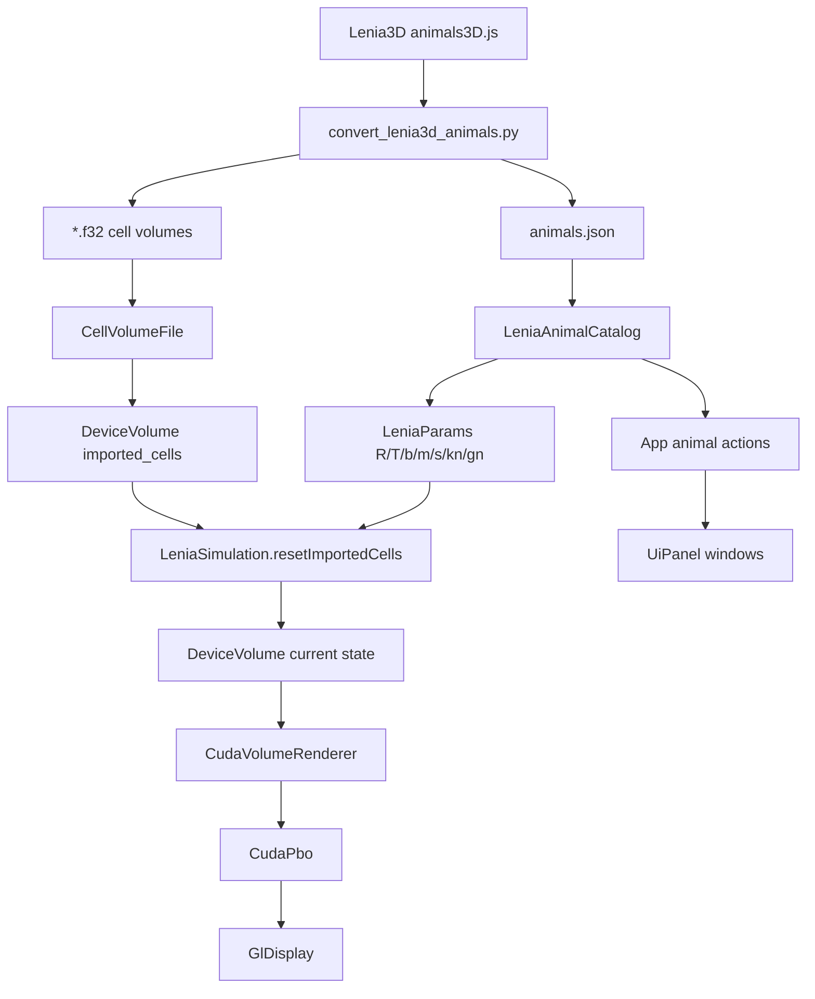

# Milestone 04 复盘与教学笔记：Lenia3D Biology Catalog Import

## 1. 这次实现了什么

Milestone 04 把项目从“能跑 single-channel 3D Lenia simulation”推进到“能加载 Lenia3D reference organism catalog”。这一步的重点不是新增一个更复杂的 renderer，而是把 `animal = initial cells + rule params` 这件事纳入当前 CUDA/cuFFT simulation。

最终能力可以概括成：

- 用 `uv run python scripts/convert_lenia3d_animals.py` 从 `D:\projects\Lenia3D\src\data\animals3D.js` 转换出 36 个带 `params + cells` 的 organism。
- 生成并提交 `configs/lenia3d_reference/animals.json` 和 `assets/cells/lenia3d_reference/*.f32`。
- App 启动时读取 catalog；manifest 缺失时不阻止程序运行，只在 UI 里显示 catalog unavailable。
- Animal Catalog 支持 `Load initial state + rule`、`Apply cells only`、`Apply rule only`。
- procedural seed preset 和 debug rule preset 保持短列表，不把 36 个 animals 复制成两个长 combo。
- Lenia UI 拆成 `VolLenia Status`、`Display & Camera`、`Lenia Simulation`、`Animal Catalog` 四个窗口。
- NaN/Inf validation 可关闭，resolution options 扩展到 `64/96/128/160/192/256`。
- Animal combo 的可见 label 现在会全局唯一；原始 `name/code/cname` 仍保留为 provenance metadata。

这次最后的小修正是重名动物显示。Lenia3D 参考数据里确实存在 raw name 或 code 重复，甚至有一组 `name + code` 都相同：

```text
Stylomembranome tardus / 4MeS3t
```

所以 runtime 现在生成 `display_name`，规则是：

```text
name
name [code]                  // name 重复时
name [code] src #sourceIndex // name + code 仍重复时
```

最后几个原参考里没有名字的条目继续显示为 `Animal #32` 这类 fallback。

已做过的验证包括：

```powershell
uv run python scripts/convert_lenia3d_animals.py --input D:\projects\Lenia3D\src\data\animals3D.js --manifest configs\lenia3d_reference\animals.json --cells-dir assets\cells\lenia3d_reference --limit 0
uv run python -m py_compile scripts\convert_lenia3d_animals.py
cmake --build --preset release
cmake --build build --config Debug
cmd.exe /c 'call "C:\Program Files\Microsoft Visual Studio\2022\Community\VC\Auxiliary\Build\vcvars64.bat" && cmake --build --preset clangd-ninja'
git diff --check
rg -n "glRead|ReadPixels|glDrawPixels|cudaMemcpyDeviceToHost|cudaMemcpyDtoH" src CMakeLists.txt
```

你也实测确认了 catalog、加载和分辨率相关行为基本没问题。

## 2. 现在的代码结构



几个边界值得记住：

- `scripts/convert_lenia3d_animals.py` 只负责把 JS reference data 变成项目自己的 assets，不把 JS runtime 带进来。
- `LeniaAnimalCatalog` 只读 manifest metadata 和 rule params，不加载 `.f32` 大块 cell data。
- `CellVolumeFile::loadToDevice()` 只从磁盘读 `.f32` 到 CPU host vector，再 H2D 到 `DeviceVolume`；它不从 GPU simulation state 做 full-volume readback。
- `LeniaSimulation::resetImportedCells()` 把 source cells center-pad 到当前 simulation volume，不 stretch、不 resample。
- renderer 仍然只消费 `DeviceVolumeView`，所以 imported animals 和 procedural seeds 都走同一条 volume rendering path。

这个结构的好处是：catalog、simulation、renderer 三者的职责没有缠在一起。以后要换 importer、换 simulation backend，或者继续改 renderer，边界都比较清楚。

## 3. 关键实现路径

### 3.1 数据转换

converter 做了四件事：

```text
1. 从 animals3D.js 提取带 params + cells 的 entries
2. 解析 b 里的 fraction shell weights，例如 3/4、7/12
3. 复刻 Lenia3D RLE decode，把 cells 解成 3D scalar field
4. 按 x-fastest layout 写成 little-endian float32
```

当前 `.f32` layout 和 simulation/renderer 一致：

```cpp
index = (z * ny + y) * nx + x;
```

这件事很重要。只要 converter、`DeviceVolume`、cuFFT plan、renderer texture upload 里任何一个地方把 axis order 理解错，画面可能仍然“有东西”，但 animal 的几何结构会被转置或切片错位。

### 3.2 Animal source model

Milestone 03 里，parameter preset 和 seed preset 是分开的：

```text
Debug rule preset + procedural seed preset
```

Milestone 04 加了 coupled animal 入口：

```text
Animal preset = imported cells + imported params
```

但我们没有把 36 个 animals 同时塞进 seed combo 和 rule combo。现在 UI 语义是：

- `Animal Catalog` 是长列表，负责 reference organisms。
- `Load initial state + rule` 应用 cells 和 params。
- `Apply cells only` 只换初始结构，保留当前 rule。
- `Apply rule only` 只换 rule，保留当前 state。
- `Procedural seed preset` 只保留少量 debug seed。
- `Debug rule preset` 只保留少量手工规则入口。

这个设计很干净：长列表只有一个，短列表仍然适合调试。

### 3.3 Imported cells 的语义

Lenia3D 里的 `cells` 不是稳定终态快照，也不是多通道 cell type。它是初始 scalar field：

```text
A(x, y, z) in [0, 1]
```

所以按钮文案改成了 `Load initial state + rule`。加载后 generation reset 为 0；是否继续播放遵循当前 `Play` 状态。

runtime placement 是 center padding：

```text
clear target volume
copy source cells into center
clamp to [0, 1]
reset generation
```

这和 Lenia3D `GridUtils.resize()` 的 padding 思路一致，第一版不做 interpolation/stretch。

### 3.4 Kernel core 和 growth function

`LeniaParams` 现在能表达 Lenia3D 的 `kn` 和 `gn`：

```text
kn -> KernelCoreType
gn -> GrowthFunctionType
```

至少已实现并接入：

- `PolynomialBump`
- `ExponentialBump`
- `Polynomial` growth
- `Gaussian` growth
- `Step` growth/debug path

`R/kernel core/shell_count/b[]` 会影响 convolution kernel，所以要 mark kernel dirty。`T/m/s/growth function` 只影响 update，不需要重建 cuFFT plan。

## 4. 踩过的坑与修正

| 坑 | 症状 | 原因 | 修正 | 学到什么 |
|---|---|---|---|---|
| 以为 name + code 足够唯一 | Animal combo 仍有重复项 | 参考 catalog 里存在 `name + code` 都相同的 entries | runtime `display_name` 第二阶段追加 `src #source_index` | reference metadata 不一定能直接当 UI primary key |
| README 还写 subset / first 12 | 文档和实际 full import 不一致 | PLAN 04b 已改成 full catalog，但 README 文案没同步 | 改成 full imported catalog，命令保留 `--limit 0` | 生成资产旁边的 README 要和默认命令保持一致 |
| `cname` 在 ImGui 里不舒服 | 字体/显示不稳定，也增加信息噪声 | ImGui 默认字体和多语言 metadata 不一定匹配 | UI 不显示 `cname`，JSON 继续保留 | provenance metadata 不一定都要进入主 UI |
| 四个功能挤在一个长窗口里 | UI 难扫，workflow 变慢 | controls 从 renderer 扩展到 simulation/catalog 后单窗不再合适 | 拆成四个工具窗并初始锚到四角 | 工具 UI 到一定复杂度后，空间组织比多加 separator 更重要 |
| 误以为滑翔生物消失是边界问题 | 部分 glide-like organism 在高分辨率下很快消失 | 当前 cuFFT 已经是 periodic convolution；实测更像 grid size / 参数尺度问题 | 用 64 起步验证，并把分辨率影响写入文档 | Lenia 参数通常不是 resolution-invariant |
| NaN validation 每步读回可能拖慢探索 | validation 很安全，但每步 CPU sync 会影响流畅度 | 读回 invalid flag 会引入同步点 | 增加可关闭 checkbox，默认关闭 | debug safety 和 interactive performance 要能切换 |

## 5. 值得补的知识点

### 5.1 为什么 cuFFT 卷积天然是 wrap

当前 simulation 是：

```text
FFT(A) * FFT(K) -> IFFT
```

这种 convolution 是 circular convolution，也就是 toroidal / periodic boundary。直觉上，grid 的右边界会接回左边界，前后上下也一样。

Lenia3D 参考实现也是 FFT 路径：`fftn(grid) * kernel` 再 `ifftn()`。所以“滑翔机从边缘消失”不太像是因为我们漏了 wrap。当前更合理的解释是：同一个 organism 被放进不同 grid size 后，动态条件变了。

如果以后真的想做 zero/clamp/finite boundary，它不是一个轻量 bool 开关。通常需要 padded FFT、overlap-save，或者 direct convolution/stencil backend。那会是一个单独 simulation milestone。

### 5.2 为什么改 resolution 后参数要重新搜索

这次你实测发现部分 organism 在不同分辨率下表现不一样，这个判断非常关键。

Lenia 的规则参数和 grid 尺度是耦合的：

- `R` 是 kernel radius，用 grid cell 为单位。
- `b[]` 描述 `R` 内不同 radial shells 的权重。
- `m/s` 描述 potential `U` 落在哪个范围时增长。
- imported cells 是固定大小的初始结构，例如 `14 x 13 x 13` 或 `64 x 26 x 64`。

当我们把同一个 cells center-pad 到 `64^3`、`128^3`、`160^3` 时，没有 stretch cells。于是：

```text
source cells 的绝对大小不变
target grid 的空白空间变多
相对体积和质量密度变小
同一个 R 相对整体世界尺寸变小
ray marcher 的可见性和阈值也会变化
```

Lenia3D 参考默认 simulation shape 是 `[64,64,64]`。所以如果目标是观察 reference organism 的原始行为，最好从 `64` 起步。换到 `128/160/256` 后，常常需要重新调 `R/m/s/T/b`，或者至少把 renderer threshold / density scale 调到更容易看见的范围。

换句话说：高分辨率不是单纯的“更清晰”。在当前 center-pad 语义下，它也是一个不同的生态容器。

### 5.3 Coupled preset 和 decoupled experiment 都有价值

`Load initial state + rule` 是复现 reference animal 的路径。它把 curated initial cells 和对应 params 一起加载。

`Apply cells only` 和 `Apply rule only` 则是探索路径。它们允许你问这样的问题：

```text
这个初态在另一个 rule 下会怎样？
这个 rule 能不能维持别的 geometry？
手动改 sigma 后，这个 animal 是更稳定还是更容易消散？
```

这也是为什么没有把 animal 分裂成 seed list 和 param list。那样看似更“正交”，实际 UI 会变成三个长列表，而且更容易误解“animal”这个概念。

### 5.4 Runtime label 不等于 data identity

manifest 里的 `id/source_index/slug/code/name/cname` 各自用途不同：

- `id`：本项目导入后的顺序 ID。
- `source_index`：原始 `animals3D.js` 数组里的位置。
- `slug`：文件名和稳定路径。
- `code/name/cname`：reference metadata。
- `display_name`：runtime UI 为避免混淆生成的可见标签。

这次重名问题的教训是：UI label 不应该直接假设某个 metadata 字段唯一。更稳的做法是保留原始 metadata，再额外生成专门给 UI 用的 label。

## 6. 怎么继续验证或扩展

最小运行验收：

```powershell
.\build\Release\VolLenia_Playground.exe
```

建议手动检查：

- Animal Catalog 能列出 36 个 entries。
- `Stylomembranome tardus [4MeS3t] src #36` 和 `src #37` 可区分。
- `Load initial state + rule` 后，cells source 和 rule source 都显示同一个 animal。
- `Apply cells only` 后，只改变 cells source。
- `Apply rule only` 后，只改变 rule source，并重建 kernel。
- 用 `64` 分辨率加载 glide-like organism，再和 `128/160` 对比。
- 如果高分辨率下快速消失，先调低 render threshold 或改用 MIP/FirstHit 观察，不急着怀疑边界条件。

后续比较自然的方向：

- 给 Animal Catalog 增加 search/filter，而不是让 36 个 entries 继续靠滚动选择。
- 增加 lightweight statistics，例如 total mass / active voxel count，但要避免每帧 full-volume CPU readback。
- 做一个 “reference resolution mode”，加载 animal 时自动切到 `64`，方便先看原始行为。
- 如果要研究 finite boundary，再单独设计 padded FFT 或 direct convolution backend。

当前 milestone 的价值在于：项目已经有了从 reference biology catalog 到 CUDA simulation 的完整纵向链路。它还不是 bit-exact Lenia3D clone，但已经足够支撑下一轮更有趣的 biology exploration。
