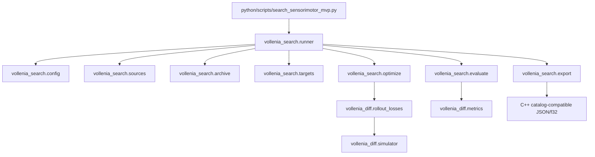
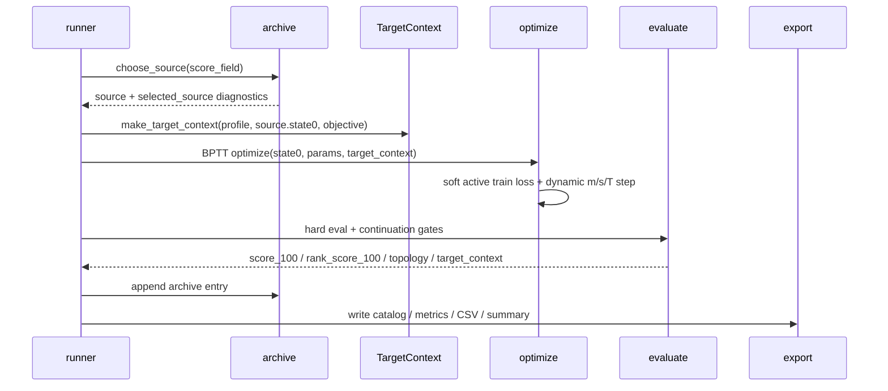

# Plan 07.5 复盘与教学笔记：Search Refactor、Target 语义与训练稳定化

## 1. 这次实现了什么

Plan 07.5 是一次“先稳住搜索基础设施，再继续扩模型”的中间里程碑。它没有实现 Expanded Lenia、Flow Lenia、多通道或资源场，而是把 Plan 07 已经能跑的搜索系统整理成更适合继续发展的形状。

这次最重要的变化有五类：

- `python/scripts/search_sensorimotor_mvp.py` 从 2300 行左右的巨型脚本变成 thin CLI wrapper。
- 新增 `python/vollenia_search/` 包，`config / archive / sources / mutation / optimize / evaluate / export / progress / profiles / targets` 已经从单纯模块入口推进成主要实现模块；`runner.py` 现在约 360 行，主要负责 outer search orchestration 和 legacy compatibility aliases。
- source selection 显式支持 `score_100`、`rank_score_100`、`adaptive`、`rescue_mixed_score`，并把 selected source 的诊断字段写进 archive/export。
- BPTT loss 里的 active terms 改用 soft active 版本；hard threshold active metrics 继续只用于 eval、topology gate 和诊断。
- `move_shape_target` 的 target 从“全局只根据第一个 source 生成一次”改成每个 candidate 都有自己的 `TargetContext`，loss、eval、export 使用同一份 target 坐标。

配置上有一个重要选择：

- `configs/search_mvp/rescue_unstable_animal/default.yaml` 默认改成 `rank_score_100`，更偏向稳定性和 long eval。
- `configs/search_mvp/rescue_unstable_animal/default_animal_24.yaml` 保持 `score_100`，因为 animal 24 专项配置已经验证过能 work，不在这轮冒然改变搜索行为。

这次没有实现 hot/cold archive 存储系统，也没有添加 `TensorRef / GpuTensorRef / CpuTensorRef / DiskTensorRef` 接口代码。原因很简单：现在还没有明显 vRAM 压力，提前做容易把抽象固定在错误的模型大小上。相关设计被放进 summary 和本文 todo，等 Expanded/Flow 或大 archive 实验真的吃紧时再做。

已验证项：

```text
uv run python -m pytest -p no:cacheprovider --basetemp .tmp_pytest_search_refactor python/tests
=> 58 passed, 15 warnings

uv run python python/scripts/search_sensorimotor_mvp.py --config configs/search_mvp/move_shape_target/default.yaml --size 64 --steps 2 --iterations 1 --inner-optim-steps 1 --debug-allow-size-32 --out outputs/search_mvp/plan07_5_smoke_move
=> wrote outputs

uv run python python/scripts/search_sensorimotor_mvp.py --config configs/search_mvp/rescue_unstable_animal/default.yaml --size 64 --steps 2 --iterations 1 --inner-optim-steps 1 --out outputs/search_mvp/plan07_5_smoke_rescue
=> wrote outputs

uv run python python/scripts/search_sensorimotor_mvp.py --config configs/search_mvp/rescue_unstable_animal/default_animal_24.yaml --size 64 --steps 2 --iterations 1 --inner-optim-steps 1 --out outputs/search_mvp/plan07_5_smoke_animal24
=> wrote outputs
```

运行时仍会看到 PowerShell profile 的 conda 噪声；`torch.compile` 对 complex FFT operator 也会给性能 warning。这两个都没有阻断测试或 smoke run。

## 2. 现在的代码结构

当前 Python 搜索路径大致是：



几个关键点：

- CLI wrapper 只负责把 `python/` 加入 import path，然后调用 `vollenia_search.runner.main()`。
- `runner.py` 现在主要是 orchestration/兼容层：它从各子模块 import 实现并保留旧名字，方便旧测试、notebook 或脚本继续通过 `search_sensorimotor_mvp` 找到函数。
- `targets.py` 是这轮真正新增的独立逻辑：它定义 `TargetSpec`、`TargetStage`、`TargetContext`，把 target 从 loose dict 变成可记录、可导出的 candidate-level 对象。
- `metrics.py` 新增 soft active helpers；`rollout_losses.py` 使用它们做训练 loss，但 eval 和 gate 仍然读 hard descriptors。
- `simulator.py` 新增 `dynamic_step()`，给 tensor `m/s/T` 路径提供 compiled step 和 fallback metadata。

这次结构的实际价值不是“文件变多”，而是把未来要继续拆的边界标出来了：config、target、archive selection、optimization、evaluation、export 不应该长期混在一个函数里。

## 3. 关键实现路径

一次 search candidate 现在可以这样理解：



### Source selection

之前 archive 里同时有两个分数：

- `score_100`：短程 objective loss 转换出来的 raw score。
- `rank_score_100`：被 life gate / continuation gate cap 过的 ranking score。

Plan 07 时这两个字段有点隐式，容易造成“想用 near-miss，却不小心只按 gate 后分数选”或者反过来的情况。现在 `source_selection_config.score_field` 显式决定 selection 用哪个分数。

新增模式：

- `score_100`：更愿意复用 raw loss 好的 near-miss，适合 from-zero early search。
- `rank_score_100`：更保守，更偏向已经通过 gate 或长程更稳的候选，适合普通 rescue。
- `adaptive`：如果 archive 里还没有 life-gate pass 的候选，就用 `score_100`；一旦有生命候选，就切到 `rank_score_100`。
- `rescue_mixed_score`：在 `rank_score_100` 基础上轻微加入 raw score 和 longest passed horizon bonus。

### Soft active training terms

旧的 hard active count 是：

```python
active_voxels = (state > threshold).sum()
```

它适合 eval，但不适合训练。因为 threshold 比较几乎到处没有梯度，BPTT 很难从 “差一点超过阈值” 得到连续信号。

现在训练里用：

```python
soft_active_field = sigmoid((state - threshold) * sharpness)
```

直觉上，它把“是否 active”从硬开关变成软开关。靠近 threshold 的 voxel 会有梯度，optimizer 能知道往哪边推。注意这不改变 hard eval：life gate 仍然用真实 threshold 结果，避免训练 surrogate 和最终筛选混为一谈。

### Per-candidate target context

旧逻辑在 `main()` 开头用第一个初始 source 算一次 target，后续所有候选都复用它。这对 `move_shape_target` 不合理，因为 target 是“相对当前 candidate 初始 COM 的 offset”。

现在每次选择 source 后都会生成：

```text
source.state0 -> TargetContext
```

其中包括：

- 最终 target voxel 坐标。
- normalized target 坐标。
- staged target 的每个 stage target。
- 可导出的 JSON metadata。

这保证训练 loss、hard eval、导出 metadata 看的是同一个目标，而不是三个地方各算一遍。

### Dynamic compiled step

原来的 compiled simulator step 只适合固定 scalar `m/s/T`。一旦 inner BPTT 里把 `m/s/T` 作为 tensor 参数优化，就会绕过 compiled path。

现在 `LeniaSimulator.dynamic_step()` 支持：

```text
state, kernel_hat, tensor m, tensor s, tensor T -> next_state
```

cache key 按 shape、dtype、device、`gn`、clip mode、compile backend/mode 组织。如果 `torch.compile` 失败，会 fallback 到 eager，并在 metrics 里写 `compile_metadata`。这比直接 crash 更适合长搜索。

## 4. 踩过的坑与修正

| 坑 | 症状 | 原因 | 修正 | 学到什么 |
|---|---|---|---|---|
| 普通 rescue 和 animal 24 的 score 默认不能一刀切 | plan 想把 rescue 改成 `rank_score_100`，但 animal 24 已经验证过 `score_100` 可行 | 不同 rescue 配置承担不同实验角色 | 普通 rescue 改 `rank_score_100`，animal 24 保持 `score_100` | 配置默认值也是实验结论的一部分，不要把专项 probe 当普通默认 |
| hard active count 对训练不友好 | active_ratio / occupancy 看起来有 objective，但 gradient 信号弱 | `(state > threshold)` 是硬阈值，几乎不可微 | 训练 loss 使用 soft active，eval 保留 hard active | train surrogate 和 eval criterion 可以分开，但必须记录清楚 |
| target 只生成一次会污染 candidate 目标 | 不同 source 的初始 COM 不同，但目标位置相同 | target 是相对初始状态的，却被全局缓存 | 引入 per-candidate `TargetContext` | “相对目标”必须绑定到具体样本，不要放进全局配置结果 |
| 动态 `m/s/T` 绕过 compiled step | `compile_step=True` 对 tensor 参数训练帮助有限 | 固定 scalar step 和动态 tensor step 是两条路径 | 增加 `dynamic_step()` 和 fallback metadata | 编译优化要看真实调用路径，不只是看 flag |
| 脚本拆包容易破测试 import | 原测试大量 import 脚本内部函数 | 单脚本时代内部函数被测试当成 API 用了 | wrapper 用 `sys.modules[__name__] = runner` 保持兼容，测试逐步改为 patch/import 新模块 | 重构时先保 API，再迁测试，不要一次把地毯抽走 |
| hot/cold archive 太早实现会过度设计 | 现在还没有明显 vRAM 压力 | Plan 08 的 state/channel/field 尺寸还没定 | 只在 summary 和 milestone todo 记录策略，不写 TensorRef | 性能架构要等压力出现或模型尺寸明确后再固化 |

## 5. 值得补的知识点

### 5.1 `score_100` 和 `rank_score_100` 是两种不同语言

`score_100` 说的是：“这个 candidate 在短程 objective 上看起来有多好。”

`rank_score_100` 说的是：“这个 candidate 在 hard eval 和 continuation gate 后，还值不值得被当作高排名结果。”

from-zero search 早期常常需要保留 near-miss，所以 `score_100` 有价值。rescue search 则更容易被短程假稳定骗，所以普通 rescue 更适合 `rank_score_100`。animal 24 是特例：已有实验说明当前 `score_100` 路线能找到东西，所以保留。

### 5.2 Soft metric 不是“放水”，而是给梯度一个方向

很多生命判定必须是 hard 的，比如 active voxel 数、axis span、border leak。这些适合回答“最后算不算生命”。

但训练时 optimizer 需要连续信号。soft active 的作用不是降低标准，而是在 threshold 附近告诉模型：这个 voxel 再高一点就会变 active。最终候选仍然要过 hard gate。

### 5.3 Config dataclass 的价值

现在 `SearchConfig` 等 dataclass 还不是完全替代 runner 的 `argparse.Namespace`，但它们已经提供了一个 typed surface。后续好处是：

- 测试可以直接加载 YAML，检查默认值和类型。
- 新配置项有集中位置。
- 未来拆 runner 时，函数签名可以逐渐从“大 Namespace”变成明确的 config 对象。

### 5.4 Archive 存储为什么暂时不做

当前 archive 仍然把 tensor 留在 memory dict 里。对 64³ 或少量 128³ 实验，这很直接，也减少 bug 面。

只有当出现这些信号时，才值得实现 hot/cold archive：

- 4060 Ti 上 128³ 搜索几百个 candidate 后显存开始顶。
- Expanded/Flow 引入多通道、多 field，单个 candidate tensor 成本明显上升。
- archive 想保留几千个 near-miss，并且还希望后续继续采样旧候选。
- 需要长实验中断恢复，而不是只保留 top-k/checkpoint。

建议实现顺序：

1. 先让 archive entry 只保存 scalar metadata 和 `state_ref`。
2. 实现 GPU hot set + CPU cold tensor，不急着 disk。
3. source selection 只看 JSON scalar，只有选中后才把 tensor 搬回 GPU。
4. 再加 disk snapshot，用于 exported、checkpointed 或 long-horizon passed candidate。
5. 最后做从 `archive.json` + refs 恢复。

4060 Ti 小实验可先用现在的内存 archive。5090 可以撑更久，但 Expanded/Flow 后 tensor 数量会乘起来，所以那时仍然要回到这个 todo。

## 6. 怎么继续验证或扩展

最小 smoke test：

```text
uv run python python/scripts/search_sensorimotor_mvp.py --config configs/search_mvp/move_shape_target/default.yaml --size 64 --steps 2 --iterations 1 --inner-optim-steps 1 --debug-allow-size-32 --out outputs/search_mvp/plan07_5_smoke_move
```

普通 rescue smoke：

```text
uv run python python/scripts/search_sensorimotor_mvp.py --config configs/search_mvp/rescue_unstable_animal/default.yaml --size 64 --steps 2 --iterations 1 --inner-optim-steps 1 --out outputs/search_mvp/plan07_5_smoke_rescue
```

Animal 24 专项 smoke：

```text
uv run python python/scripts/search_sensorimotor_mvp.py --config configs/search_mvp/rescue_unstable_animal/default_animal_24.yaml --size 64 --steps 2 --iterations 1 --inner-optim-steps 1 --out outputs/search_mvp/plan07_5_smoke_animal24
```

下一步建议：

- 后续继续减少 legacy aliases 的使用面；新代码优先从 `vollenia_search.*` 具体模块 import。
- 在更长 rescue run 里比较 `rank_score_100`、`adaptive`、`rescue_mixed_score` 的实际 archive 复用行为。
- 在 `move_shape_target` 上检查 per-candidate target metadata，确认 staged target 和 visual behavior 对齐。
- Plan 08 前优先设计 Expanded/Flow 的 model spec，而不是继续堆搜索策略。

## 7. Todo 备忘

- Archive 存储策略暂时不实现。等 128³/多通道/Flow 或大 archive 明显出现 vRAM/CPU memory 压力时，再实现 GPU hot set、CPU cold tensor、disk snapshot 三层策略。
- `runner.py` 已经拆薄；后续可以在 Plan 08 后视情况删除 legacy aliases，进一步缩小兼容层。
- `rescue_mixed_score` 目前有公式和测试，但还需要真实长跑实验判断权重是否合理。
- `torch.compile` 对 complex FFT operator 会 warning，当前不阻塞；后续如果性能敏感，需要单独 benchmark eager vs compiled dynamic step。
- Animal 24 的 `score_100` 配置是保守保留，不代表所有 rescue 专项都应该沿用这个默认。
