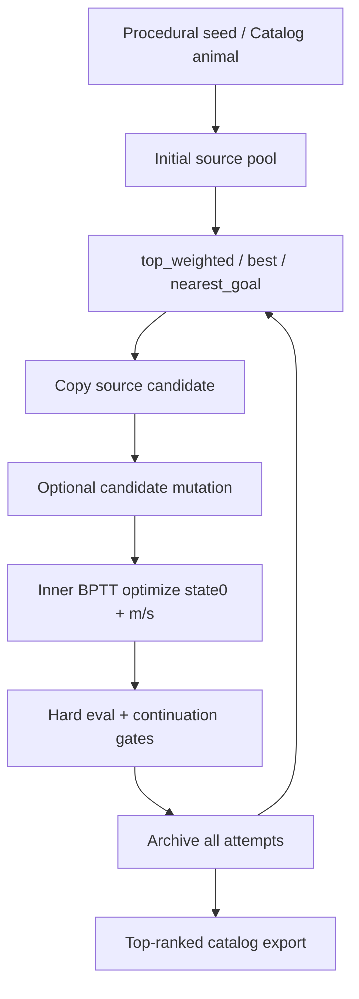

# Plan 07 复盘与教学笔记：From-zero Search、Rescue Repair 与生命判定

## 1. 这轮实现了什么

Plan 07 把 VolLenia 从“可微 rollout + C++ 可视化 bridge”推进到了第一个真正可迭代的搜索系统。当前保留两条已实现主线：

- `move_shape_target`：from-zero 特定目标搜索，从 procedural seed 出发，优化 initial logits 和连续 rule 参数 `m/s`，尝试让形体向 staged target 移动。
- `rescue_unstable_animal`：repair search，从 catalog/GUI 里“可能 work 但不稳定”的初始状态出发，围绕原 animal 做多分支修复。

本轮明确删除了旧的 `maintain_animal_profile`。它之前夹在“保持现有 animal”和“修复不稳定 animal”之间，概念不够干净。后续如果要做 from stable animal optimization，应作为第三条策略重新设计，而不是继续沿用 maintain。

关键代码变化：

- `python/scripts/search_sensorimotor_mvp.py`
  - CLI profile 只保留 `move_shape_target` 和 `rescue_unstable_animal`。
  - 新增 `top_weighted` source selection：从 archive top-k 按配置 score softmax 采样，不要求 `life_gate_pass=True`。
  - rescue 默认变成多 repair branch：fresh catalog variants 直接 full inner optimize，archive 派生 candidate 再做小 mutation。

- `python/vollenia_diff/rollout_losses.py`
  - 删除 maintain wrapper 语义。
  - 新增名义清晰的 `rescue_unstable_animal_loss`。
  - rescue loss 保留相对 profile terms，并加入 broad `absolute_occupancy`，避免坏初始状态本身成为唯一目标。

- `configs/search_mvp/`
  - 删除 `maintain_animal_profile/default.yaml`。
  - `move_shape_target/default.yaml` 默认改用 `top_weighted`。
  - `rescue_unstable_animal/default.yaml` 默认使用 16 个 repair branch、`R/m/s` source randomization、1000-step continuation eval。
  - `rescue_unstable_animal/default_animal_24.yaml` 保留为 animal 24 专项 probe，使用更长 `[100,200,500,1000,2000]` eval horizon。

- `docs/07_sensorimotor_search_design.md`
  - 更新为当前两条主线，并把 from stable animal optimization 写成未来派生策略。

## 2. 当前实验结果摘要

这轮不是只做了代码基础设施，也已经跑出了一些有判断价值的实验结果：

- `move_shape_target`：目前最好的结果是得到了一种可以撑到约 2000 步后才消失的类稳态生命。它已经不是几百步内立刻噪声化或坍缩的失败候选，但分数仍然不高，主要因为位置/目标对齐不够好。这说明 from-zero 路线已经能找到“比较像生命”的 attractor，但当前 Lenia 参数空间和 objective 还不足以稳定地产生“既活着、又按目标移动/停在目标附近”的结果。
- `rescue_unstable_animal`：大多数 catalog animal 都能在很少几步外层循环内 repair 成功，说明当前 rescue strategy 对“本来已经接近稳定生命”的初始状态很有效。
- Animal 24：这是比较难的例子。它早期表现为 loss 缓慢下降但 long eval 不稳定；新策略下第三次外层循环找到了稳定生命。这个生命不是原始状态那种一直移动，而是移动一段后进入静止稳定状态。它算是 rescue 成功，也算找到了一种新的生命运动模式。

这三个结果合在一起，给出的判断是：当前搜索 infrastructure 已经能产出有意义的实验反馈；rescue 路线已经实用，from-zero move 还在受限于 Lenia 形式和可微参数空间。

## 3. 当前搜索结构



一个容易误解的点：archive 记录全部尝试，不只记录“已经是生命”的候选。是否值得导出和作为 best，靠 `rank_score_100`、long eval 和 gate cap 决定。这样做的好处是 early from-zero search 可以保留 near-miss basin；坏处是 archive 里失败数会很多，所以诊断字段必须足够完整。

## 4. From-zero move 策略复习

`move_shape_target` 的目标是从零搜索出“有生命感、能朝目标移动或保持在目标附近”的形体。它现在的机制是：

- procedural source 多样化：`mixed_blobs`、rule randomization、source injection。
- BPTT 优化：默认优化 initial logits + `m/s`，不默认优化 `T`，避免把目标变成调时间尺度。
- mutation：archive source 被复制成 candidate 后做小扰动，scheduled no-mutation 则深挖已有 basin。
- staged target profile：可以在 rollout 中间和最终步分别施加不同 target offset。
- ranking：训练 loss 转成 `score_100`，再由 life gate / continuation gate cap 成 `rank_score_100`。

为什么 move 目前还难：

- 3D Lenia 的稳定参数空间比 2D 更稀疏。
- 只优化 `m/s` 和 initial state，kernel shape 仍主要靠外层随机/变异。
- 从零 seed 很容易走向两类坏 attractor：消失，或大范围闪烁噪声。
- 500-step 后才崩的假稳定 candidate 很常见，所以短 eval 的 score 高不代表真稳定。
- 当前最好结果已经接近“长程类稳态”，但目标位置不够好，说明问题不只是 survival，也包括行为目标和动力学自由度不足。

这也是为什么这轮把 move 的 source selection 从 `top_alive_weighted` 改成 `top_weighted`：from-zero 早期如果只允许 life-gate pass 的 elite 被复用，会过早切断仍可修的 near-miss。

## 5. Rescue 为什么不同于 move

Rescue 的输入不是随机 seed，而是一个“看起来像生命、但缩放/长跑/某些参数下不稳定”的 catalog animal。因此合理策略不同：

- move 要更多探索，rescue 要围绕已有 animal 做局部 repair。
- move 可以从失败 near-miss 里继续挖，rescue 也允许失败 near-miss 被采样，但需要更强 long eval 排名。
- rescue 的 source-level randomization 只扰动 `R/m/s`，默认不动 `T/kn/gn/ring_count`，避免把 animal identity 改太远。
- rescue 的 candidate mutation 也更保守：小幅 initial logits + 小幅 `R/m/s`。
- rescue 默认 continuation horizon 更长：`[100,200,500,1000]`，Animal 24 专项到 `2000`。

本轮 smoke 里 Animal 24 的现象很典型：前几个 branch 的训练 loss 很低，但 100-step continuation 因 `compact_axis_border_leak` 失败；另一个 branch 在短 probe 里通过了 long eval。后来更长一点的实验里，Animal 24 在第三次外层循环得到了稳定生命。它不是初始状态那种持续移动的生命，而是先移动、再停下来进入稳定形态。这也很有价值：它说明 rescue 不只是在“恢复原来的动物”，还可能找到新的生命运动模式或新的 attractor。

这个说明“loss 降”不等于“有稳定 attractor”，repair search 必须把长程 hard eval 作为主要筛选器。同时也提醒我们，life / behavior 的目标不能写得太窄：如果只把“持续移动”当作成功，移动后稳定的生命会被误杀；如果只看“稳定”，又会错过移动行为本身。后续需要把行为描述符和稳定性 gate 分开记录。

## 6. Topology-aware life gate 的作用

旧 gate 默认把生命想成 blob，所以一轴满的圆柱、两轴满的膜/平面很容易被误杀。现在 gate 会先看当前 evaluated state 的拓扑：

- `blob`：0 个满轴。
- `cylinder`：1 个满轴。
- `plane`：2 个满轴。
- `global_noise`：3 个满轴，默认失败。

对 cylinder/plane，不再用全局 `active_body_radius_norm` 上限和全局 border mass 直接判死，而是看 compact axes 是否仍然紧凑、是否沿剩余轴漏到边界。这样能允许“圆柱/膜状生命”，同时继续过滤大部分 voxel 闪烁激活的全局噪声。

## 7. Animal 24 的教训

Animal 24 失败不是单纯“优化不够久”。观察到的模式是：

- 训练 loss 可以持续下降，说明局部目标在被满足。
- 但 continuation 后会沿 compact axis 泄漏或变成不稳定形态。
- 如果只看短 rollout final loss，很容易把它误认为成功。
- 第三次外层循环找到的成功分支表现为“移动后静止稳定”，不是原始视觉印象里的持续移动。

因此 rescue 不应该默认把 BPTT 拉到 1000/2000 步；这会非常贵，也可能只是在短程目标上过拟合。更合理的是：

- 用多 repair branch 增加局部邻域探索。
- 用较短 BPTT 产生 candidate。
- 用 100/200/500/1000/2000 hard eval 筛掉假稳定。
- 对真正有希望的 branch 再做专项长跑或后续 ablation。
- 在 archive 里同时保存 movement / stability / topology 描述，而不是用单一 score 概括所有生命现象。

## 8. 和 Sensorimotor Lenia 的关键差距

这轮实验也暴露了一个更根本的问题：我们现在的搜索策略已经能跑起来，但底层 Lenia 形式还不够完整。如果继续在这个不完整参数空间上堆搜索策略，实验成本会很高，而且结论容易误导。

当前 VolLenia 可微部分主要是：

- initial state logits：可微。
- growth 参数 `m/s`：可微。
- `T`：实现上可微，但默认关闭，因为它很容易把搜索变成调时间尺度，而不是找到更好的生命动力学。
- `R/b/kn/gn/ring_count`：目前主要作为外层 randomization / mutation，不走 BPTT。

参考 Sensorimotor Lenia / Flow Lenia 风格的代码通常更强调可微形态参数化：

- kernel radius / scale 可以是平滑参数，而不是离散重建。
- kernel ring 或 kernel mixture 的权重可以连续变化。
- growth field、flow field 或感知到动作的映射可以是可微模块。
- 有些实现用 kernel-level mask / smooth mask，让“某个 kernel 层是否启用、启用多少”可以被 gradient 调整，而不是只能在外层随机开关。

### 为什么 `R` 现在不好直接微分

在当前实现里，`R` 不只是一个普通标量。它参与 kernel grid 的空间缩放，并最终影响 `kernel_hat`：

```text
R / b / kn / gn / ring_count
  -> build radial kernel in real space
  -> normalize kernel
  -> torch.fft.rfftn(kernel)
  -> rollout convolution
```

如果每次 optimizer step 都让 `R` 变化，就需要不断重建 kernel 和 `kernel_hat`。这有几个问题：

- 性能差：FFT kernel cache 会失效，每步重建大张量和 FFT。
- graph 复杂：kernel generation、normalization、FFT 都进入 autograd，会让 BPTT 更重。
- 离散结构冲突：`ring_count`、`kn/gn`、`b` 长度/语义变化不是连续可微参数。
- C++ bridge 语义也会受影响：catalog 里现在的 rule schema 更接近传统 Lenia 参数，不是 smooth multi-kernel schema。

这不是说 `R` 永远不能可微，而是需要先重构 Lenia 形式：把 kernel 参数设计成连续、固定形状、可缓存/可编译友好的表达。比如固定最大 kernel basis 数量，然后优化连续 radius、width、amplitude、mask，而不是每次改变 ring 数量和数组结构。

### 为什么下一步先扩 Lenia 形式

这轮搜索实验的直觉是：搜索策略当然还能改，但如果生命模型本身的可优化自由度太少，策略越复杂，越容易只是在有限空间里反复筛假稳定。更值得的下一步是扩展 Lenia 形式本身：

- 让 kernel / growth / flow 里更多参数可微。
- 让参数空间更接近参考 Sensorimotor / Flow Lenia 的连续可优化形式。
- 为未来 neural Lenia 或 neural Flow Lenia 留接口：例如用小网络生成 growth/flow、感知场或局部更新规则。

最终目标可以逐步从当前的 “differentiable Lenia backend” 推向：

```text
classic Lenia
  -> differentiable VolLenia with richer continuous kernels
  -> Flow Lenia style transport / mass-preserving dynamics
  -> neural / neural-flow Lenia
```

这也是为什么下一阶段可以暂时暂停继续扩 search policy：先把被搜索的动力系统变得更值得搜索。

## 9. 未来派生策略

后续可以把搜索拆成更清楚的三类：

- From-zero target search：继续扩大初始化、mutation 和参数空间，目标是从随机 seed 找到稳定且符合行为目标的 organism。
- Rescue unstable animal：继续强化多分支 repair、long eval ranking、稳定性诊断，目标是救已有不稳定/缩放脆弱 animal。
- From stable animal optimization：从已稳定 animal 出发做行为/形态优化，允许更大胆的 mutation，但用 stability gate 保底。这条路线应独立实现，不复活 `maintain_animal_profile`。

更远的方向：

- 可微 kernel / multi-kernel 参数空间，比如参考代码中的 smooth kernel-level mask。
- Flow Lenia / neural Flow Lenia，让生命不仅是 density update，也包含可学习或可参数化的 transport dynamics。
- 长程稳定 objective 或 truncated/chunked BPTT，但要避免误杀会闪烁、会阶段性变形的生命。
- MAP-Elites / QD archive，把 topology、movement、mass、radius、stability horizon 作为 behavior descriptor。
- C++ headless worker 或批量 GUI preview，加速大规模候选筛选。

## 10. 验证记录

本轮验证过：

```text
uv run python -m py_compile python/scripts/search_sensorimotor_mvp.py python/vollenia_diff/rollout_losses.py python/tests/test_plan07_primitives.py
=> passed

uv run python -m pytest -p no:cacheprovider --basetemp .tmp_pytest_rescue_refactor python/tests
=> 53 passed, 14 warnings

uv run python python/scripts/search_sensorimotor_mvp.py --config configs/search_mvp/rescue_unstable_animal/default.yaml --size 64 --steps 50 --iterations 4 --inner-optim-steps 4 --out outputs/search_mvp/rescue_refactor_smoke_64
=> wrote catalog/archive/metrics

uv run python python/scripts/search_sensorimotor_mvp.py --config configs/search_mvp/rescue_unstable_animal/default_animal_24.yaml --size 64 --steps 50 --iterations 4 --inner-optim-steps 8 --out outputs/search_mvp/rescue_animal24_refactor_probe_64
=> wrote catalog/archive/metrics
```

PowerShell 启动时仍会打印 conda profile 的无害噪声，但命令本身通过。
