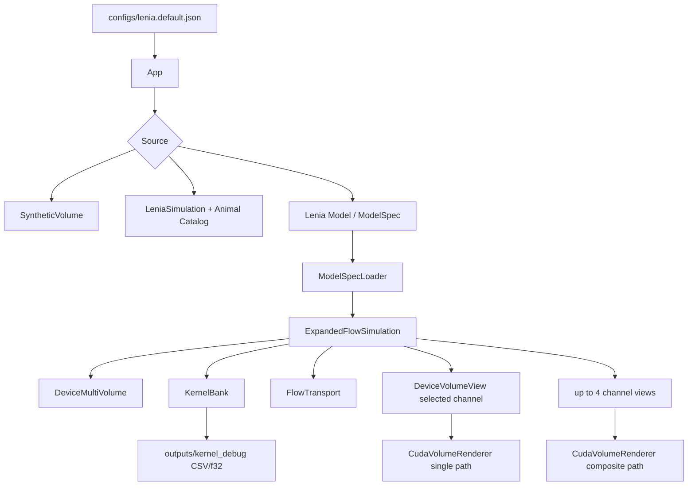
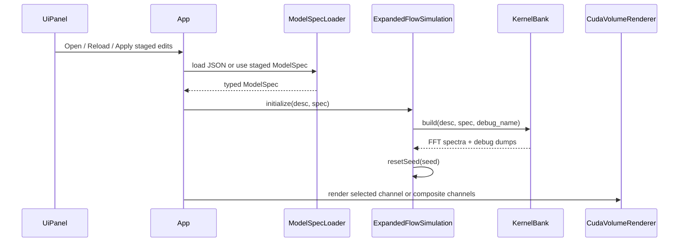

# Plan 08.1 复盘与教学笔记：C++ Expanded/Flow Core、Lenia Model GUI 与多通道渲染

## 1. 这次实现了什么

Plan 08.1 把 VolLenia 的 C++ runtime 从 legacy single-channel Lenia 往“可配置、多通道、多核、可扩展到 Flow Lenia”的方向推进了一大步。这轮没有迁移 Python search，也没有替换旧 animal catalog；旧 `LeniaSimulation` 和 legacy catalog 仍然保留。新增的是一条并行路径：GUI 里叫 `Lenia Model`，内部 schema 和 C++ 类型仍叫 `ModelSpec`。

最终能力可以概括成五块：

- 新增 `ModelSpec` JSON：可以描述 channels、update mode、Flow 参数、kernel list、growth function 和 render channel。
- 新增 multi-channel simulation core：`DeviceMultiVolume` 使用 channel-major / x-fastest 布局，`ExpandedFlowSimulation` 能运行 expanded additive 和 Flow 两种模式。
- 新增 `KernelBank`：从 `smooth_gaussian_mixture` 或 `legacy_shell` 构建空间核，归一化后 FFT，并输出 kernel debug CSV / `.f32` slice。
- GUI 新增 `Lenia Model` source：可以打开/重载 preset、play/pause、single step、reset seed、编辑 staged model 参数并 `Apply/Rebuild model`。
- renderer 支持 multi-channel composite：保留旧 single-channel path，同时新增最多 4 个 channel 的彩色 composite path。

这轮还做了几个体验层 polish：

- 默认启动改为 `Lenia Model`，但默认 model 仍是轻量的 `expanded_single_kernel.json`，不直接打开复杂 Flow。
- `Render` 区被提前到 Lenia Model 面板上方，`Single channel / Composite channels` 和 `Render channel` 放在一起。
- 关键参数加了 ImGui hover tooltip，减少“看到参数名但忘了含义”的摩擦。
- 新增 `flow_three_channel_complex.json`，作为 3 channel / 7 kernel 的复杂示例。

已验证项：

```text
uv run python -m json.tool configs/modelspec/flow_three_channel_complex.json
=> passed

uv run python -m json.tool configs/lenia.default.json
=> passed

git diff --check
=> passed, only LF/CRLF warnings

cmake --preset vs2022-x64
cmake --build --preset release
=> passed, wrote build/Release/VolLenia_Playground.exe

default Lenia Model smoke, 8 seconds
=> no early exit, kernel_debug_count=2

3-channel Lenia Model smoke, 8 seconds
=> no early exit, kernel_debug_count=14
```

未完全自动验证的是 GUI 人工交互：tooltip 悬停、composite 视觉效果、手动加载 preset 后切 single/composite、编辑参数后 Apply/Rebuild 的手感。这些已经编译通过并做了启动 smoke，但仍需要实际看窗口确认体验。

## 2. 现在的代码结构

这轮新增的是 C++ runtime 的第二条 simulation path。旧路径没有消失：



关键文件和职责：

- `src/model/ModelSpec.h/.cpp`：JSON schema 的 C++ 表达和校验入口。它负责把 `expanded_additive | flow`、channel role、kernel family、growth family 等字符串变成 typed enum。
- `src/sim/DeviceMultiVolume.h/.cu`：多通道 device storage。布局是 `A[c,z,y,x]`，这样每个 channel 是连续 3D volume，容易暴露成旧 renderer 能理解的 `DeviceVolumeView`。
- `src/sim/KernelBank.h/.cu`：按 model spec 生成每个 kernel 的 FFT spectrum，并 dump debug 文件。
- `src/sim/ExpandedFlowSimulation.h/.cu`：新 simulation path 的核心。expanded additive 和 Flow 都先通过 kernel bank 计算 affinity，再分别进入 additive update 或 transport update。
- `src/sim/FlowTransport.h/.cu`：Flow 的 target-centric gather transport。
- `src/render/CudaVolumeRenderer.h/.cu`：旧 single-channel raymarch 保留；新增 composite texture upload/render path。
- `src/app/App.*` 和 `src/app/UiPanel.*`：把 Lenia Model 接到 GUI、配置、文件选择器、状态显示、staged edit/rebuild。

`ModelSpec` 和 GUI 里的 `Lenia Model` 是同一个东西的两层命名：前者是工程/schema 名，后者是用户界面名。这样做的好处是用户不需要看到抽象工程术语，但代码里仍然保留一个稳定的 schema 名称。

## 3. 关键实现路径

### 3.1 ModelSpec 加载与重建

用户从 GUI 选择 `Lenia Model` 后，运行路径大致是：



一个容易忽略的设计点：GUI 编辑并不是 runtime hot-swap。channel/kernel/basis 的 add/remove 和参数编辑只改 `modelspec_staged_`，按 `Apply/Rebuild model` 后才复制到 active `modelspec_` 并重建 simulation/kernel bank。这个限制很朴素，但能避免“正在模拟的 GPU buffers 和 UI 里的 channel/kernel 数量已经不一致”的 bug。

### 3.2 Expanded additive

expanded additive 可以理解成“多 channel、多 kernel 的传统 Lenia update”：

```text
Ahat[src] = FFT(A[src])
P[k] = IFFT(Ahat[src[k]] * Khat[k])
U[dst[k]] += weight[k] * growth_k(P[k])
A_next[c] = clamp(A[c] + dt * U[c], 0, 1)
```

这里的 `U` 在代码里叫 affinity。每个 kernel 都有自己的 `src` 和 `dst`，所以 `a_to_b` 这种跨 channel 作用可以自然表达。

### 3.3 Flow mode

Flow mode 复用 expanded affinity 的计算，但不直接把 `U` 加回状态，而是用它生成 transport field：

```text
grad_U = Sobel3D(U)
grad_A_sum = Sobel3D(sum(A_matter))
alpha = clamp((A_sum / theta_A) ^ alpha_power, 0, 1)
F = (1 - alpha) * grad_U - alpha * grad_A_sum
A_next = target-centric gather(A, F)
```

Stage 1 只实现 `transport_sigma = 0.5`。这不是偷懒，而是刻意收窄接口：先验证 Flow path、mass behavior 和 renderer integration，再决定是否支持更一般的 transport kernel。

### 3.4 多通道渲染

renderer 现在有两条路径：

- Single channel：把 selected channel 暴露为 `DeviceVolumeView`，走原来的 `uploadVolume()` / `render()`。
- Composite channels：最多上传前 4 个 channel 到 4 个 3D texture，用 cyan、deep blue、gold、magenta palette 做体渲染混合。

当前 composite 的语义是“多个 component channel 的视觉叠加”，不是额外的跨通道物理渲染。这个和 Flow Lenia 论文里的 2D multi-channel 图像更接近：每个 channel 本身就是一种状态组件，复杂性来自它们在 simulation 里的相互作用，而不是 renderer 再发明一层交互。

## 4. 踩过的坑与修正

| 坑 | 症状 | 原因 | 修正 | 学到什么 |
|---|---|---|---|---|
| build 路径一开始用了 `build-sm89` | 用户希望主验证产物在 `build/Release` | 之前为了 4060 Ti 使用了 sm89 preset，但不符合项目主 build 路径 | `vs2022-x64` binary dir 仍用 `build/`，CUDA arch 固定为 `89` | GPU arch 和 build output dir 是两个不同决策，不要绑在一起 |
| GUI 里叫 `ModelSpec` 不够友好 | Source combo 和错误文案像工程内部名 | `ModelSpec` 是 schema 名，不是用户心智模型 | GUI 文案改为 `Lenia Model`，内部类型和 JSON 路径保持 `ModelSpec` | 内部准确命名和外部可理解命名可以分层 |
| render mode 和 render channel 离得太远 | simulation panel 很长，切 single channel 不方便 | 初版按实现顺序把 render 区放到了后面 | 新增前置 `Render` 区，render mode 和 channel slider 放一起 | GUI 顺序应按使用流程，不按代码实现顺序 |
| 多 channel 看起来像“几个单 channel 拼起来” | 期待可能是更复杂的 multi-channel visualization | 当前 renderer 是 component overlay，复杂性在 simulation 而不是 shader | 保留 composite 语义，并用 tooltip 说明它是 visual overlay | 不要为视觉“复杂”牺牲可解释性；2-3 channel 已经能产生复杂形态 |
| 128³ + 3 channel + 多 kernel 明显掉帧 | 4060 Ti 上低于 30 FPS | 体素数从 64³ 到 128³ 是 8 倍，Flow 还叠加 channel/kernel/transport 成本 | tooltip 里提示 64/96 更适合编辑复杂 Flow；优化列入后续 TODO | 性能下降符合复杂度，不要把预期成本误判成 bug |
| UI 直接热插拔 channel/kernel 风险高 | add/remove 后 GPU buffers、kernel bank、UI staged state 可能不一致 | 结构变化会改变 model shape，不是普通参数滑条 | 采用 staged edit + Apply/Rebuild；remove last channel 会检查 kernel 引用 | 结构编辑最好显式 rebuild，避免半热更新状态错位 |
| kernel debug 很重要但容易忘 | 新 kernel 看不见空间形状，调参像猜 | FFT spectrum 不直观 | 每个 kernel dump radial profile CSV 和 z-mid `.f32` slice | simulation core 的 debug artifact 要和核心路径一起做，不要等出问题再补 |

## 5. 值得补的知识点

### 5.1 为什么用 ModelSpec

旧 animal catalog 更像“legacy Lenia 参数 + 初始 cells”的集合；它适合复现已有 animal，但不适合描述多 channel、多 kernel、Flow transport。`ModelSpec` 的作用是给新的模型路径一个明确数据结构：

```text
channels
update mode
flow params
kernels[src, dst, family, basis, growth]
render channel
```

这让 GUI、simulation、renderer 和未来 Python search 都可以围绕同一份 model description 工作。

### 5.2 Channel-major 布局为什么合适

`DeviceMultiVolume` 使用：

```text
A[c,z,y,x]
```

也就是每个 channel 是一块连续的 3D volume。这样做有几个实际好处：

- old renderer 想看单个 channel 时，只要给它 `channelData(c)` 和同一个 `VolumeDesc`。
- FFT 某个 source channel 时，输入是连续内存，比较直接。
- composite renderer 上传多个 channel 时，可以逐 channel 拷到 3D texture。

另一种布局是 voxel-major，比如 `A[z,y,x,c]`。它对“每个 voxel 读所有 channel”方便，但对当前 FFT-per-channel 和旧 renderer 兼容不如 channel-major 顺手。

### 5.3 KernelBank 的价值

Lenia update 的核心是 convolution。GPU 上用 FFT 做 convolution 时，kernel 需要先变成 spectrum：

```text
spatial kernel -> normalize -> FFT -> Khat
```

`KernelBank` 把这个过程集中起来，有两个好处：

- simulation step 不需要每帧重建 kernel。
- debug dump 可以和 kernel build 绑定，保证看到的 profile/slice 就是实际用于 simulation 的 kernel。

这次 `smooth_gaussian_mixture` 用 CPU double 累加归一化，再 copy 到 GPU 做 FFT。这样比一开始就在 GPU 上散着写更容易保证 Stage 1 正确性。

### 5.4 Flow 的 target-centric gather

transport 有两种常见写法：

- source-centric splat：每个 source voxel 把质量撒到目标位置，通常需要 atomic。
- target-centric gather：每个 target voxel 反向采样 source 周围位置，避免 atomic。

这轮实现的是 target-centric gather，配合固定 `transport_sigma=0.5`。它不一定是最终最快版本，但更容易先做出稳定、可调试的 Stage 1。

### 5.5 ImGui 的 staged edit 心智模型

这次 UI 有两份 model：

```text
modelspec_        active model, simulation 正在用
modelspec_staged_ GUI 正在编辑
```

普通参数滑动只改 staged；按 `Apply/Rebuild model` 后才让 active model 接受 staged state。这个模式很适合“会改变 buffer shape / kernel count / channel count”的编辑器。它比每次滑动都重建更稳，也比隐式保存更容易理解。

## 6. 后续性能和架构建议

128³ + 3 channel + 多 kernel 在 4060 Ti 上低于 30 FPS 是预期内的。粗略直觉是：

- 128³ 的 voxel 数是 64³ 的 8 倍。
- 每个 channel 都可能需要 FFT。
- 每个 kernel 都有一次 spectrum multiply + inverse FFT + growth accumulation。
- Flow 还要做 Sobel gradient、matter sum、transport gather。
- composite render 还会上传/采样多个 3D texture。

后续如果要明显提速，优先级可以这样排：

1. 按 `src` channel 复用 FFT：同一个 source channel 被多个 kernel 使用时，不要重复做 state FFT。
2. kernel batch/chunking：保留现在的结构，但按 batch 处理 kernel，控制临时 buffer 和调度开销。
3. 跳过不可见 composite upload：composite 关闭或 channel hidden 时，不上传对应 texture。
4. render texture half/packing：如果视觉允许，可以用 half 或 packed channel 降低带宽。
5. 降低每帧 CPU/GPU 同步：mass/status 不一定每帧都要完整同步。
6. 更激进的 Flow transport backend：未来可比较 target-centric gather 与 source-centric splat/atomic 的性能。

这些都不急着塞进 08.1。当前更重要的是：模型路径、GUI、debug artifact 和基础验证已经通了。

## 7. 怎么继续验证或扩展

最小启动：

```nu
.\build\Release\VolLenia_Playground.exe
```

推荐手动验收顺序：

1. 启动后确认默认 source 是 `Lenia Model`。
2. 默认 `expanded_single_kernel.json` 能显示并播放。
3. 在 `Render` 区切 `Single channel / Composite channels`。
4. 打开 `configs/modelspec/flow_two_channel.json`，看两个 channel 的 single 和 composite。
5. 打开 `configs/modelspec/flow_three_channel_complex.json`，先用 64 或 96 resolution 观察，再试 128。
6. 改一个 kernel 的 `weight/R/growth mu`，按 `Apply/Rebuild model`，确认能重建。
7. 测试 `Add channel`、`Add kernel`、`Add basis`，再 `Apply/Rebuild model`。
8. 测试 remove last channel 在被 kernel 引用时会阻止。

命令层验证：

```nu
uv run python -m json.tool configs/modelspec/flow_three_channel_complex.json
uv run python -m json.tool configs/lenia.default.json
cmake --preset vs2022-x64
cmake --build --preset release
```

## 8. Todo 备忘

- Python search 暂时没有接入 `ModelSpec`。后续 Plan 08/09 可以让 search 读写同一份 schema，而不是直接操作 legacy Lenia 参数。
- `hidden_reserved/static_env/render_only` channel role 现在能 parse 和显示，但 Stage 1 只更新/运输 `matter`。
- `transport_sigma` 仍固定为 0.5；未来如果确实需要更一般的 transport kernel，再扩。
- composite render 现在是视觉 overlay；如果以后需要更科学的 multi-channel transfer function，可以单独设计 shader/UI。
- 复杂 3 channel preset 是示例，不是 benchmark 或稳定生命结论。
- 还没有保存 GUI staged edits 到 JSON 的功能；当前编辑只影响本次运行 session。
- 大模型性能优化先从 FFT reuse 和 composite upload skip 做起，收益最清晰。
