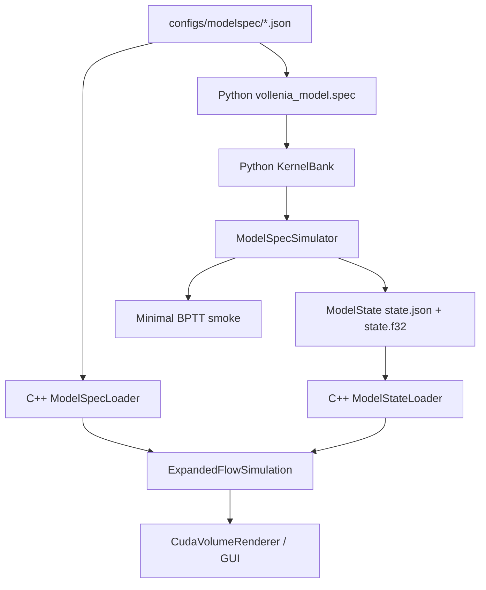

# Plan 08.2 复盘与教学笔记：PyTorch Expanded/Flow Twin、ModelState Bridge 与 C++ 性能修复

## 1. 这次实现了什么

Plan 08.2 的核心目标是把 08.1 的 C++ `Lenia Model / ModelSpec` 路径变成可微实验可以使用的对象。现在已经有了一条 Python PyTorch twin：它能读取同一份 ModelSpec JSON，构建多通道、多核 expanded / flow simulation，跑短 rollout，并把结果导出成 C++ GUI 能打开的 multi-channel ModelState。

最重要的边界也要先说清楚：这次**还没有把 ModelSpec/Flow Lenia 接入 07/07.5 的完整 sensorimotor search 系统**。也就是说，现在不是已经有 archive、source selection、target context、hard eval、continuation gate 那套完整搜索。当前完成的是：

- 一个可微 PyTorch ModelSpec backend。
- 一个最小 BPTT smoke：优化 initial logits，证明 gradient 能穿过 ModelSpec rollout。
- 一个 Python -> C++ 的 ModelState bridge，方便把 Python 生成的多通道状态拿回 GUI 看。

这相当于先铺好“新模型可微、可视化、可导出”的地基，下一步才适合把它接进 `vollenia_search` 的正式 runner/evaluate/export 流程。

本轮主要变化：

- 新增 `python/vollenia_model/`
  - `spec.py`：解析和校验 C++ 同款 ModelSpec JSON。
  - `kernels.py`：实现 `smooth_gaussian_mixture` / `legacy_shell` kernel bank。
  - `growth.py`：实现 `gaussian` / `polynomial_lenia3d` growth。
  - `expanded_flow.py`：实现 expanded additive 和 Flow step。
  - `flow_transport.py`：实现 Sobel3D 与 sigma=0.5 target-centric reintegration。
  - `export_state.py`：导出 channel-major ModelState manifest + `.f32`。
  - `visualization.py`：输出 kernel z-mid slice、radial profile、basis component PNG。
  - `parity.py`：提供 eager / compiled benchmark helper。

- 新增 Python scripts
  - `plot_modelspec_kernels.py`
  - `torch_modelspec_rollout.py`
  - `benchmark_modelspec_torch_compile.py`
  - `search_modelspec_flow_smoke.py`

- C++ 修复和 bridge
  - Flow reintegration `dd` 修正，支持 `reintegration_dd` override。
  - mass diagnostics 变成 GUI checkbox，默认关闭，避免每帧整通道 CPU copy。
  - 新增 `ModelStateLoader`，C++ GUI 支持打开 Python 导出的 ModelState。
  - GUI 显示实际 transport `dd`，以及 mass diagnostics 是否开启。

按你的要求，kernel visualization 这轮**不输出 CSV radial profile**，只输出 PNG。验证里确认了 `flow_three_channel_complex` 输出 21 个 PNG、0 个 CSV。

已验证项：

```text
uv run python -m pytest -p no:cacheprovider --basetemp .tmp_pytest_modelspec_twin python/tests
=> 65 passed, 14 warnings

uv run python python/scripts/plot_modelspec_kernels.py --spec configs/modelspec/flow_three_channel_complex.json --out outputs/modelspec_kernel_plots/flow_three_channel_complex
=> wrote 21 PNG files, 0 CSV files

uv run python python/scripts/torch_modelspec_rollout.py --spec configs/modelspec/flow_three_channel_complex.json --size 64 --steps 8 --out outputs/modelspec_twin/flow_three_channel_smoke
=> wrote ModelState manifest and state.f32

uv run python python/scripts/benchmark_modelspec_torch_compile.py --spec configs/modelspec/flow_single_channel.json --size 64 --steps 16 --out outputs/modelspec_twin/bench_flow_single
=> wrote benchmark.json, max_abs_diff around 9e-6

uv run python python/scripts/search_modelspec_flow_smoke.py --spec configs/modelspec/expanded_single_kernel.json --size 64 --steps 8 --iters 2 --out outputs/modelspec_twin/search_smoke
=> wrote optimized ModelState smoke output

cmake --preset vs2022-x64
cmake --build --preset release
=> passed

default app hidden smoke, 6 seconds
=> no early exit

legacy Lenia source hidden smoke, 6 seconds
=> no early exit
```

未自动验证项：

- GUI 里手动点击 `Open state...` 打开 Python 导出的 `state.json`，需要人工确认视觉效果。
- Python/C++ one-step numeric parity 还没有做严密误差表；当前只是语义 twin 和 smoke 级别验证。
- `torch.compile` benchmark 还没有拆分 compile time 和 steady-state runtime。

## 2. 现在的代码结构

Stage 08.2 之后，ModelSpec 路线变成了一个双栈结构：



可以这样理解：

- C++ 仍然是交互式可视化和 GUI 侧 runtime。
- Python 是可微实验和搜索原型侧 runtime。
- ModelSpec JSON 是两边共享的模型描述。
- ModelState 是 Python 到 C++ 的状态桥。

旧 `vollenia_diff` 和 `vollenia_search` 还在，负责 legacy single-channel differentiable Lenia 和 Plan 07/07.5 的搜索框架。新 `vollenia_model` 暂时没有塞进这两个包里，是为了避免把 legacy Lenia 和 Expanded/Flow 的语义混在一起。

## 3. 关键实现路径

### 3.1 Python expanded additive

Python twin 的 expanded additive 路径和 C++ 语义一致：

```text
A_hat[c] = rfftn(A[c])
P_hat[k] = A_hat[src[k]] * K_hat[k]
P[k] = irfftn(P_hat[k])
U[dst[k]] += weight[k] * growth_k(P[k])
A_next = clamp(A + dt * U, 0, 1)
```

实现上会先对所有 channel 做一次 FFT，然后 kernel chunk 里按 `src` 索引复用 `A_hat`。这点比“每个 kernel 都重新 FFT source channel”更接近未来可扩展版本。

### 3.2 Python Flow step

Flow step 复用 expanded affinity `U`，再走 transport：

```text
A_sum = sum(matter channels)
grad_A = Sobel3D(A_sum)
grad_U = Sobel3D(U[c])
alpha = clamp((A_sum / theta_A) ** alpha_power, 0, 1)
F = (1 - alpha) * grad_U - alpha * grad_A
F = clamp(F, -flow_max, flow_max)
A_next[c] = reintegration_sigma_half(A[c], F[c])
```

`flow_transport.py` 的 `reintegrate_sigma_half()` 用 `torch.roll` 做 target-centric gather。这个版本优先匹配 C++/FlowLenia 的直觉和可微性，不追求最终最快。

### 3.3 ModelState bridge

Python 导出的 manifest 形状是：

```json
{
  "format_version": 1,
  "model_spec": "../../../configs/modelspec/flow_three_channel_complex.json",
  "layout": "channel-major-x-fastest",
  "dims": [64, 64, 64],
  "channels": 3,
  "state_file": "state.f32",
  "render": {
    "composite": true,
    "render_channel": 0
  }
}
```

二进制 `.f32` 是：

```text
A[c,z,y,x] float32, x fastest, channel-major
```

C++ 的 `ModelStateLoader` 读取 manifest 后，会先加载它指向的 ModelSpec，再把 state 写入 `ExpandedFlowSimulation`。这个设计避免了“state 文件自己携带所有模型参数”的复杂性，也让 GUI 仍然通过 ModelSpec 理解 channel/kernel/render 语义。

### 3.4 C++ `dd` 修复

之前 C++ transport 用的是：

```text
ceil(flow_max + 1e-6)
```

这有两个问题：

- 没有乘 `dt`，所以不是最大位移。
- 对 exact integer 加 `1e-6` 会把 `ceil(1.000001)` 变成 2，3D gather 从 27 offsets 变成 125 offsets。

现在规则变成：

```text
if reintegration_dd > 0:
    dd = reintegration_dd
else:
    dd = max(1, ceil(dt * flow_max + transport_sigma - 1e-6))
```

并且 kernel 内用：

```text
ma = max(dd - transport_sigma, 0)
mu = p + clamp(dt * F, -ma, ma)
```

这更接近 FlowLenia reference 里 `ma = dd - sigma` 的心智模型。

## 4. 踩过的坑与修正

| 坑 | 症状 | 原因 | 修正 | 学到什么 |
|---|---|---|---|---|
| 容易把 minimal BPTT smoke 误读成完整 sensorimotor search 接入 | 看到 `search_modelspec_flow_smoke.py` 可能以为已经接入 07.5 search | 脚本名里有 search，但它没有 archive/source selection/eval gate | 文档明确它只是 initial logits BPTT smoke | smoke 证明可微链路，不等于完整搜索系统 |
| `torch.compile` 计时容易误导 | benchmark 显示 compiled_ms 很大 | 当前脚本没有分离首次 compile / graph capture / steady-state runtime | 复盘里只说“compiled 路径数值接近，计时口径需改进” | compile benchmark 必须 warmup，并单独记录 compile wall time |
| C++ mass diagnostics 每帧 full copy | 128³ 多 channel 交互时可能掉帧/同步 | `matterMass()` 逐 matter channel copy 到 CPU 后求和 | GUI 加 `Mass diagnostics` checkbox，默认关闭 | Debug 指标不能默认拖慢交互 loop |
| Flow `dd` 公式放大 gather stencil | `flow_max=1` 可能变成 `dd=2` | `ceil(flow_max + 1e-6)` 错把 exact integer 推到下一档 | 改成 dt-aware 公式，并支持 spec override | reintegration stencil 是性能敏感参数，epsilon 方向很重要 |
| ModelState 不能复用 legacy catalog manifest | legacy catalog 是 single-channel animal + Lenia params | ModelSpec state 是 multi-channel + model spec reference | 新增独立 ModelState manifest | 不同数据语义不要硬塞进旧格式 |
| CSV radial profile 被计划写进要求但用户不需要 | 会增加不必要输出和维护面 | 当前阶段视觉检查 PNG 更重要 | 只输出 slice/profile/basis PNG | 计划要服从实际审阅和实验需求 |

## 5. 值得补的知识点

### 5.1 Twin 不是简单重写

PyTorch twin 的目标不是“另写一份差不多的模拟器”，而是给 C++ runtime 一个可微镜像。它需要共享：

- 同一份 ModelSpec schema。
- 同一套 channel/kernel/growth 语义。
- 同一个 state layout。
- 尽量接近的 transport 规则。

只有这样，Python 里优化出来的 state 或参数才有机会被 C++ GUI 解释和渲染。

### 5.2 为什么先做 ModelState bridge

搜索和可微优化最容易变成“只看 loss 数字”。ModelState bridge 的价值是：Python 侧每次得到有趣 candidate，都可以导出成 GUI 能打开的 multi-channel 状态。

这比只保存 `.pt` tensor 更实用，因为视觉检查能快速发现：

- channel 是否全被一个 channel 吞掉；
- composite 是否有结构；
- Flow 是否变成全局 smear；
- state 是否被 clamp 到大片 1 或消失到 0。

### 5.3 Mass conservation 和 mass diagnostics 是两件事

Flow transport 理论上希望更接近 mass-preserving，但 GUI 里的 mass diagnostics 是一个 debug 观测工具。它不应该默认拖慢模拟。

因此这轮选择：

```text
mass behavior: simulation 仍按 Flow transport 算
mass diagnostics: 默认不观测，需要 checkbox 才 CPU 同步
```

以后如果 mass 变成常用指标，再把它换成 GPU reduction，而不是恢复 full-volume CPU copy。

### 5.4 `torch.compile` benchmark 应该怎么改

当前 `benchmark_step()` 是：

```text
compiled_fn = torch.compile(step_fn)
compiled_value, compiled_ms = run(compiled_fn)
```

这会让第一次调用 compiled function 的编译/捕获成本混进 `compiled_ms`。更严谨的 benchmark 应该分三段：

```text
1. compile_create_ms: torch.compile(...) 本身
2. compile_first_call_ms: 第一次 compiled_fn(state)
3. compiled_steady_ms: warmup 后重复 N 次的平均时间
```

还要注意当前 step 里有 complex FFT，TorchInductor 会 warning：它不一定能对 complex ops 生成高质量代码。所以 Stage 08.2 的结论只能是：

- compiled 路径能跑；
- 与 eager 的 max_abs_diff 很小；
- 当前计时不代表 steady-state compiled runtime 优劣。

### 5.5 为什么还没接 sensorimotor search

07.5 的 search 系统不仅是 BPTT。它还包含：

- config/profile registry；
- source selection；
- mutation；
- per-candidate target context；
- inner optimize；
- hard eval / continuation gate；
- archive / export；
- summary / catalog bridge。

08.2 的 `search_modelspec_flow_smoke.py` 只是证明：

```text
initial logits -> ModelSpec rollout -> loss -> backward -> optimized state -> ModelState export
```

下一步如果接入正式搜索，需要把 `vollenia_model.ModelSpecSimulator` 包进 `vollenia_search.optimize/evaluate/export` 的新 profile，而不是继续堆一个更大的 smoke script。

## 6. 怎么继续验证或扩展

最小视觉验证：

```nu
.\build\Release\VolLenia_Playground.exe
```

然后在 GUI 里：

1. Source 选 `Lenia Model`。
2. 点 `Open state...`。
3. 选择 `outputs/modelspec_twin/flow_three_channel_smoke/state.json`。
4. 用 composite render 检查 3 channel 结构。
5. 打开 `Mass diagnostics` checkbox，确认 mass 数值出现；关掉后确认显示 disabled。

下一步开发建议：

- 改进 benchmark：分离 compile create、first call、steady-state runtime。
- 做 Python/C++ one-step parity：同一 ModelSpec、同一 state，比较 expanded additive 和 flow one-step 的 max abs error。
- 把 ModelSpec backend 接入 `vollenia_search`：
  - 新增 `modelspec_flow` profile。
  - source 可以来自 seed state 或 ModelState。
  - optimize 初期只训练 initial logits。
  - eval 先用 hard active / mass / continuity descriptors。
  - export 输出 ModelState，而不是 legacy animal catalog。
- 如果 128³ Flow 继续慢，优先做 C++/Python 的 source-channel FFT reuse 和更严谨 timing hooks。

## 7. Todo 备忘

- `search_modelspec_flow_smoke.py` 未来不要继续长大；它只是 smoke。正式路线应进 `vollenia_search`。
- `torch.compile` benchmark 需要 warmup 和分项计时，当前数字不可直接当性能结论。
- ModelState GUI load 已编译通过，但仍需手动视觉验收。
- Python twin 的 wall border 不是重点，torus parity 是当前基线。
- 还没实现 parameter localization、resources、neural rules、general sigma。
- 还没做 kernel CSV radial profile；这是本轮刻意不做。
